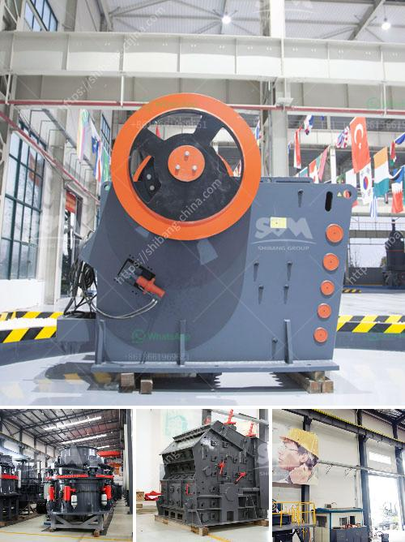

<h3>business proposal preparation for mobile crusher</h3>
As the global demand for aggregate materials continues to rise, the need for mobile crushers is also increasing. This equipment plays a significant role in the construction industry by reducing the amount of material generated during construction activities. If you are considering venturing into the mobile crusher business, it is essential to develop a comprehensive business proposal that will effectively communicate your plans to potential investors or lenders. This article aims to provide guidance on how to prepare a business proposal for a mobile crusher.

The executive summary should serve as an overview of your entire business proposal. It should highlight the key points and be concise yet persuasive. Explain the purpose of the proposal and the potential benefits that investors can obtain from funding your mobile crusher project. Include the market opportunities for mobile crushing in the construction sector, such as increasing demand for materials, cost savings, and environmental benefits.

In this section, provide an introduction to your company, including its mission, vision, and goals. Describe your experience in the industry and highlight relevant achievements. Explain why you are uniquely positioned to succeed in the mobile crusher business. This section should build confidence in the investor or lender that you have the necessary expertise and resources to execute the project successfully.

Conduct thorough market research to identify the target market for your mobile crusher services. Analyze the current market size, growth rate, and trends. Identify the major players and their competitive advantages. Furthermore, assess the demand for aggregate materials in the region you plan to operate in, and explain how your mobile crusher will address this demand effectively.

Provide detailed information about the mobile crusher you intend to use. Include specifications, such as processing capacity, mobility, and fuel consumption. Highlight the unique features of your mobile crusher that differentiate it from competitors. Outline the benefits that the mobile crusher offers to customers in terms of cost savings, time efficiency, and quality of materials produced.

Describe your marketing and sales strategy to promote your mobile crusher services. Identify the target customer segments, such as construction companies, contractors, and local municipalities. Outline the channels you will use to reach these customers, such as online advertising, industry associations, or direct sales. Explain how you plan to generate leads, nurture relationships, and convert them into paying customers.

Elaborate on how you intend to operate and manage your mobile crusher business. Discuss the required permits and regulations you need to comply with. Provide an overview of your operational processes, including equipment maintenance, safety protocols, and employee training. Outline your supply chain management strategy to ensure a steady supply of raw materials.

Include detailed financial projections to demonstrate the profitability and sustainability of your mobile crusher business. Prepare an income statement, cash flow statement, and balance sheet for at least three years. Include assumptions, such as equipment costs, operating expenses, and expected revenue. Show investors the return on investment and the timeline to break-even.

Preparing a comprehensive business proposal for a mobile crusher requires careful research, analysis, and planning. By following the steps outlined in this article, you can develop a compelling proposal that showcases the potential of your mobile crusher business. Remember to tailor your proposal to the specific needs and expectations of your target audience, whether it be investors or lenders. With a well-prepared business proposal, you can increase your chances of securing funding for your mobile crusher project.
<h3>Contact us</h3><ul><li><strong>Whatsapp:&nbsp;<a href="https://wa.me/8613661969651">+8613661969651</a></strong></li><li><a href="https://swt.shibang-china.com/?git&amp;zhl&amp;business proposal preparation for mobile crusher"><strong>Online Service(chat now)</strong></a></li></ul><h3>Related</h3><ul><li><a href='ball mill ball mill.md'>ball mill ball mill</a></li><li><a href='mobile fine jaw crusher at saudi arabia.md'>mobile fine jaw crusher at saudi arabia</a></li><li><a href='screen plants for shade.md'>screen plants for shade</a></li><li><a href='hammer crusher hammer balancing chart.md'>hammer crusher hammer balancing chart</a></li><li><a href='brand new cone crusher for sale india.md'>brand new cone crusher for sale india</a></li></ul>