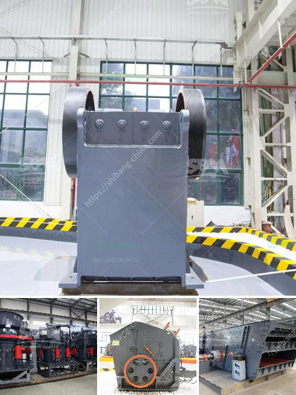

<h3>buy a roll crusher in india</h3>
India is rich in mineral resources, with abundant deposits of limestone, coal, iron ore, and other minerals. As mining activities continue to grow, the demand for reliable crushing equipment also increases. A roll crusher is an essential piece of equipment in the mining industry. It reduces large rocks to smaller sizes, making them easier to transport and process further. If you are considering buying a roll crusher in India, here are some factors to consider and benefits to expect.

1. High Production Capacity: Roll crushers are known for their high production capacity. They can handle large quantities of material and are suitable for both primary and secondary crushing. With a roll crusher, you can significantly increase your production output and meet the demands of your mining operations.

2. Versatile Crushing: A roll crusher can efficiently crush various materials, including limestone, coal, iron ore, and more. This versatility makes it a valuable asset for diverse mining applications. Whether you need to crush rocks for aggregate production or extract valuable minerals, a roll crusher can cater to your needs.

3. Cost-Effective Solution: Investing in a roll crusher can be a cost-effective solution for your mining operations. Compared to other types of crushers, roll crushers have lower capital and maintenance costs. They are less complex and have fewer moving parts, reducing the risk of breakdowns. Additionally, their efficient performance saves energy and lowers operational expenses.

4. Compact Design: Roll crushers come in various sizes, but they generally have a compact design. This allows for easy installation and integration into your existing mining system. Whether you have limited space or need a portable crushing solution, a roll crusher can meet your requirements without compromising performance.

5. Easy Maintenance: Roll crushers are designed for ease of maintenance. They typically have fewer parts compared to other crushers, making them easier to repair and replace. Regular maintenance ensures smooth operation and extends the lifespan of your equipment, reducing the need for costly repairs or replacements in the long run.

When buying a roll crusher in India, it is important to consider the reputation and quality of the manufacturer or supplier. Look for a company with a proven track record and positive customer feedback. Additionally, consider the specific requirements of your mining operations and choose a roll crusher that is suitable for your needs.

In conclusion, purchasing a roll crusher in India can be a wise investment for mining companies. Its high production capacity, versatile crushing capabilities, cost-effectiveness, compact design, and ease of maintenance make it a valuable asset. By carefully considering your requirements and choosing a reliable supplier, you can find a roll crusher that meets your needs, enhances your mining operations, and improves overall profitability.
<h3>Contact us</h3><ul><li><strong>Whatsapp:&nbsp;<a href="https://wa.me/8613661969651">+8613661969651</a></strong></li><li><a href="https://swt.shibang-china.com/?git&amp;zhl&amp;buy a roll crusher in india"><strong>Online Service(chat now)</strong></a></li></ul><h3>Related</h3><ul><li><a href='price 100 tph crusher plant.md'>price 100 tph crusher plant</a></li><li><a href='machines used for cement manufacturing.md'>machines used for cement manufacturing</a></li><li><a href='copper crusher cost.md'>copper crusher cost</a></li><li><a href='portable jaw crushers.md'>portable jaw crushers</a></li><li><a href='crusher machines for granite in nigeria.md'>crusher machines for granite in nigeria</a></li></ul>