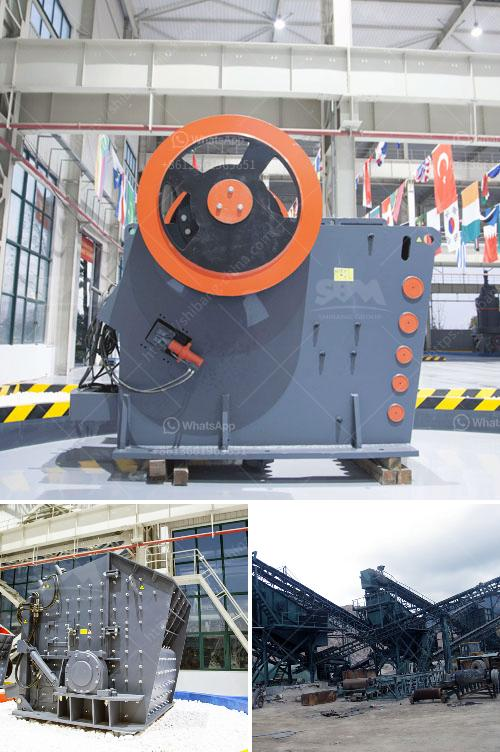

<h3>buy ball mill india</h3>
Ball mill is an essential machinery used for grinding materials in various industries, including mining, construction, ceramics, and chemical industries. It consists of a cylinder-shaped shell that rotates around its axis, partially filled with grinding media such as balls or rods.

In India, there is a growing demand for ball mills, as grinding materials through this process offers numerous advantages. First and foremost, the cost-effectiveness of ball mills is a major factor that attracts industries to invest in this machinery. The initial investment required is lower compared to other grinding options, making it a favorable choice for small and medium-sized enterprises.

Ball mills are also known for their versatility, as they can handle a wide range of materials. From minerals to ores, cement, and even certain chemicals, a ball mill can perform its task efficiently. This versatility allows industries to grind various materials, resulting in the production of high-quality products.

Another advantage of buying ball mills in India is that there are numerous suppliers and manufacturers available in the country. This gives buyers the opportunity to compare prices, quality, and services offered by different suppliers. This healthy competition drives manufacturers to maintain reasonable prices and provide excellent after-sales services, ensuring customer satisfaction.

Moreover, India has a strong industrial base, with a focus on technological advancements. This means that buyers can find ball mills equipped with the latest features and innovations, further enhancing productivity and efficiency. Manufacturers in India are constantly upgrading their machinery to meet the growing demands of the industry, providing buyers with a wider range of options to choose from.

In conclusion, buying ball mills in India offers several advantages, including cost-effectiveness, versatility, and access to a wide range of suppliers and manufacturers. Whether it's for grinding minerals, cement, or other materials, investing in a ball mill can significantly improve the production process. With the country's strong industrial base and focus on technological advancements, buyers can find high-quality machinery that meets their specific requirements.
<h3>Contact us</h3><ul><li><strong>Whatsapp:&nbsp;<a href="https://wa.me/8613661969651">+8613661969651</a></strong></li><li><a href="https://swt.shibang-china.com/?git&amp;zhl&amp;buy ball mill india"><strong>Online Service(chat now)</strong></a></li></ul><h3>Related</h3><ul><li><a href='feldspar powder making machine in india.md'>feldspar powder making machine in india</a></li><li><a href='production process clinker zurich switzerland.md'>production process clinker zurich switzerland</a></li><li><a href='cement clinker ball mill.md'>cement clinker ball mill</a></li><li><a href='ethiopia widely used rock breaking.md'>ethiopia widely used rock breaking</a></li><li><a href='mobile crushers hire south africa.md'>mobile crushers hire south africa</a></li></ul>