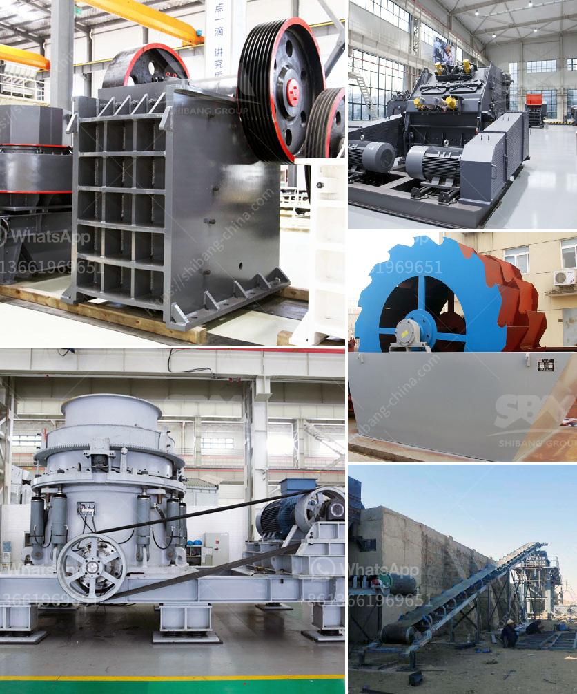

<h3>buy impact crushers</h3>
Impact crushers are widely used in the mining and construction industry for crushing various materials such as limestone, coal, quartz, dolomite, iron ore, and other minerals. These machines are designed to handle a wide range of capacities, from 30 tons per hour to 500 tons per hour.

When looking to buy an impact crusher, there are several factors to consider. First and foremost, it is crucial to determine the application and the type of material that will be processed. Different impact crushers are designed for specific materials, so it is essential to choose the right one that can handle the intended workload.

Secondly, the size and capacity of the impact crusher are significant considerations. The size of the material to be crushed and the desired output size will determine the size of the crusher required. The capacity of the machine should be chosen based on the expected production requirements.

Another key factor is the durability and quality of the machine. Impact crushers are subjected to heavy wear and tear, so it is essential to choose a crusher with high-quality components and a robust construction. Look for manufacturers who have a reputation for producing reliable and durable machines.

Additionally, it is essential to consider the ease of maintenance and the availability of spare parts. Regular maintenance ensures the longevity and optimal performance of the impact crusher. It is crucial to select a machine that comes with easy access for maintenance and a reliable supply of spare parts to minimize downtime.

Furthermore, the price of the impact crusher is an important consideration. It is advisable to compare prices from different manufacturers and consider the overall value for money. Cheaper machines may not offer the same level of quality and durability, so it is crucial to strike a balance between price and quality.

In conclusion, when buying an impact crusher, it is essential to consider the application, capacity, durability, maintenance, and price. By carefully evaluating these factors, one can find a suitable impact crusher that meets their specific requirements, ensuring efficient and reliable crushing operations.
<h3>Contact us</h3><ul><li><strong>Whatsapp:&nbsp;<a href="https://wa.me/8613661969651">+8613661969651</a></strong></li><li><a href="https://swt.shibang-china.com/?git&amp;zhl&amp;buy impact crushers"><strong>Online Service(chat now)</strong></a></li></ul><h3>Related</h3><ul><li><a href='double rotor impact hammer crusher.md'>double rotor impact hammer crusher</a></li><li><a href='decibels declined jaw crusher hebro.md'>decibels declined jaw crusher hebro</a></li><li><a href='limestone crushing machine.md'>limestone crushing machine</a></li><li><a href='aggregate quarry crusher philippines.md'>aggregate quarry crusher philippines</a></li><li><a href='biggest crucher in kenya.md'>biggest crucher in kenya</a></li></ul>