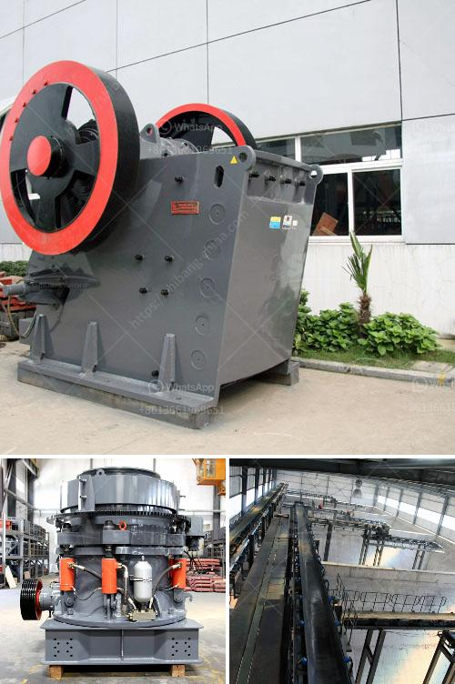

<h3>caco3 carbonate calcium line production</h3>
Caco3, also known as calcium carbonate, is a commonly found chemical compound. It is widely used in various industries, including the production of line, a versatile building material. Line production involves mining, crushing, and grinding of raw materials to produce line powder. This powder is then used in applications such as construction, agriculture, and environmental management.

The process of line production starts with the extraction of raw materials from quarries or mines. Explosives are used to break the rock into small pieces, which are then transported to crushers. Crushing machines reduce the size of the rock further, producing a mixture of various particle sizes.

The next step is grinding. Large machinery, such as ball mills or hammer mills, is used to crush and grind the line into a fine powder. This powder is then further processed to enhance its quality and consistency. Various techniques, such as sorting, grading, and purifying, are employed to achieve the desired specifications.

Once the line powder is processed and refined, it can be used in a wide range of applications. In construction, it is commonly used as a building material for roads, bridges, and buildings. Its high calcium content makes it ideal for improving soil quality in agriculture. It is also used in the manufacturing of cement, glass, ceramics, and paper.

The production of line plays a crucial role in various industries, contributing to economic growth and development. It provides employment opportunities and supports local communities. Moreover, line production is vital for sustainable development, as it utilizes abundant natural resources and helps reduce waste by recycling materials.

In conclusion, caco3 carbonate calcium line production is a complex process that involves mining, crushing, and grinding of raw materials to produce line powder. This powder finds its applications in construction, agriculture, and various other industries. The production of line contributes to economic growth, job creation, and sustainable development.
<h3>Contact us</h3><ul><li><strong>Whatsapp:&nbsp;<a href="https://wa.me/8613661969651">+8613661969651</a></strong></li><li><a href="https://swt.shibang-china.com/?git&amp;zhl&amp;caco3 carbonate calcium line production"><strong>Online Service(chat now)</strong></a></li></ul><h3>Related</h3><ul><li><a href='allis chalmers 54 x 74 gyratory crusher.md'>allis chalmers 54 x 74 gyratory crusher</a></li><li><a href='china henan machinery small ball mill.md'>china henan machinery small ball mill</a></li><li><a href='removing iron from silica sand.md'>removing iron from silica sand</a></li><li><a href='diamond and gold washing plant.md'>diamond and gold washing plant</a></li><li><a href='hot sale and low cost mobile crushing plant.md'>hot sale and low cost mobile crushing plant</a></li></ul>