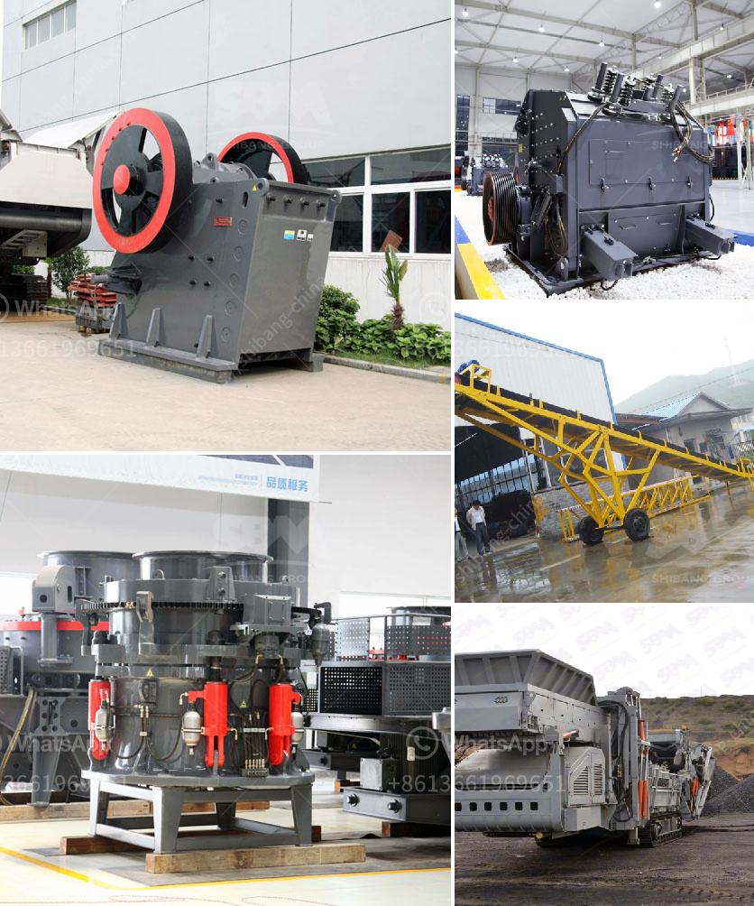

<h3>calcite and dolomite plant process</h3>
Calcite and dolomite are commonly used minerals in various industries due to their unique properties. Both minerals play a vital role in the processing of various materials, including cement, glass, and steel production. Understanding the plant process of calcite and dolomite is crucial for efficient and cost-effective operations.

Calcite and dolomite are carbonate minerals that are found in abundance in nature. Calcite is composed of calcium carbonate (CaCO3) and dolomite is a double carbonate of calcium and magnesium (CaMg(CO3)2). These minerals are often found in sedimentary rocks and are formed through the process of deposition and crystallization over millions of years.

In industrial processes, calcite and dolomite are extracted from quarries and then crushed into smaller sizes. This crushed material is then transported to processing plants for further refinement. One common method used for processing calcite and dolomite is through grinding and pulverizing.

The plant process typically involves the use of jaw crushers or hammer mills to crush the raw ore. After being crushed, the material is screened and classified according to size specifications. The smaller-sized material is then sent to grinding mills, where it is further pulverized into fine particles.

In some cases, additional processing steps may be required to remove impurities or enhance specific properties. For example, in the production of cement, calcite and dolomite are often subjected to high-temperature calcination to transform them into their respective oxides (calcium oxide and magnesium oxide). This process helps remove impurities and improves their reactivity in cement production.

Overall, the plant process of calcite and dolomite involves crushing, grinding, and sometimes additional steps to achieve the desired final product. These minerals are essential for various industries due to their wide range of applications. Understanding and optimizing the plant process is crucial for ensuring efficient production and maintaining product quality.
<h3>Contact us</h3><ul><li><strong>Whatsapp:&nbsp;<a href="https://wa.me/8613661969651">+8613661969651</a></strong></li><li><a href="https://swt.shibang-china.com/?git&amp;zhl&amp;calcite and dolomite plant process"><strong>Online Service(chat now)</strong></a></li></ul><h3>Related</h3><ul><li><a href='stone quarry crusher companies in ghana.md'>stone quarry crusher companies in ghana</a></li><li><a href='calcite mining plant.md'>calcite mining plant</a></li><li><a href='stone crashers price in south africa.md'>stone crashers price in south africa</a></li><li><a href='trackmounted equipment.md'>track-mounted equipment</a></li><li><a href='gold washing machine from rock.md'>gold washing machine from rock</a></li></ul>