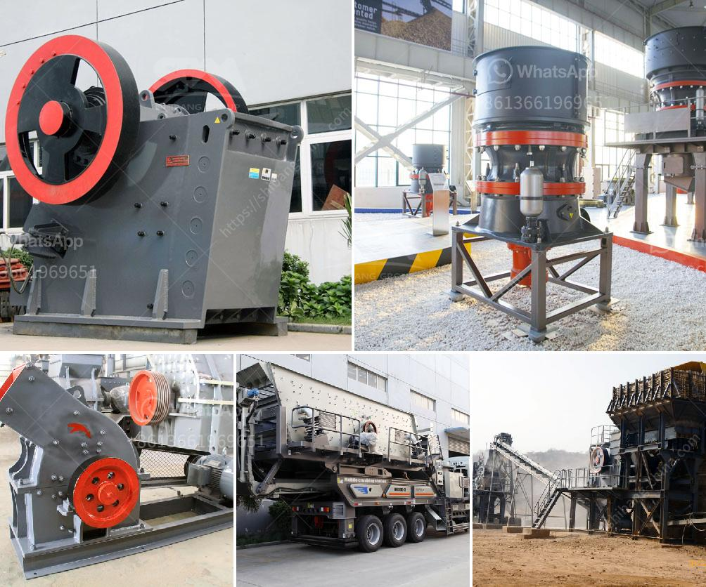

<h3>calcite ball milling equipment</h3>
Calcite is a crystalline mineral widely used in various industries due to its diverse range of applications. However, to harness its true potential, it is crucial to process calcite into the desired particles. This is where calcite ball milling equipment proves to be indispensable.

Calcite ball milling equipment refers to the equipment used for grinding calcite particles into fine powder. The quality of the final product depends on the quality of the equipment used. With the advancements in technology, manufacturers have now introduced high-tech ball milling equipment that ensures precise and efficient grinding of calcite.

One key advantage of using ball milling equipment is its adaptability. It can process both wet and dry materials, providing a versatile solution for various industries. Whether you need to grind calcite for use in the manufacturing of paints, papers, or even pharmaceuticals, ball milling equipment offers the flexibility to meet your specific requirements.

Another notable benefit of calcite ball milling equipment is its energy-saving capabilities. The advanced design and engineering of these machines minimize energy consumption while maximizing output. This is particularly important in today's environmentally conscious world, as reducing energy consumption contributes to sustainable practices.

Furthermore, calcite ball milling equipment ensures uniform particle size distribution. This is crucial for many industries as it impacts the quality and effectiveness of the final product. By achieving a consistent particle size, manufacturers can enhance the performance and appearance of their products, ultimately leading to customer satisfaction and increased market competitiveness.

In conclusion, calcite ball milling equipment plays a pivotal role in unlocking the full potential of calcite. Its adaptability, energy-saving features, and ability to produce uniform particle sizes make it an indispensable tool for various industries. Investing in high-quality ball milling equipment is a wise decision for manufacturers aiming to enhance their productivity, reduce energy consumption, and deliver outstanding results.
<h3>Contact us</h3><ul><li><strong>Whatsapp:&nbsp;<a href="https://wa.me/8613661969651">+8613661969651</a></strong></li><li><a href="https://swt.shibang-china.com/?git&amp;zhl&amp;calcite ball milling equipment"><strong>Online Service(chat now)</strong></a></li></ul><h3>Related</h3><ul><li><a href='japan crushing machine manufacturers list.md'>japan crushing machine manufacturers list</a></li><li><a href='7 in x 8 in hammer mill gold quarz.md'>7 in x 8 in hammer mill gold quarz</a></li><li><a href='crushing machines for sale.md'>crushing machines for sale</a></li><li><a href='quarry crusher machine.md'>quarry crusher machine</a></li><li><a href='50 tpd cement plant cost in india.md'>50 tpd cement plant cost in india</a></li></ul>