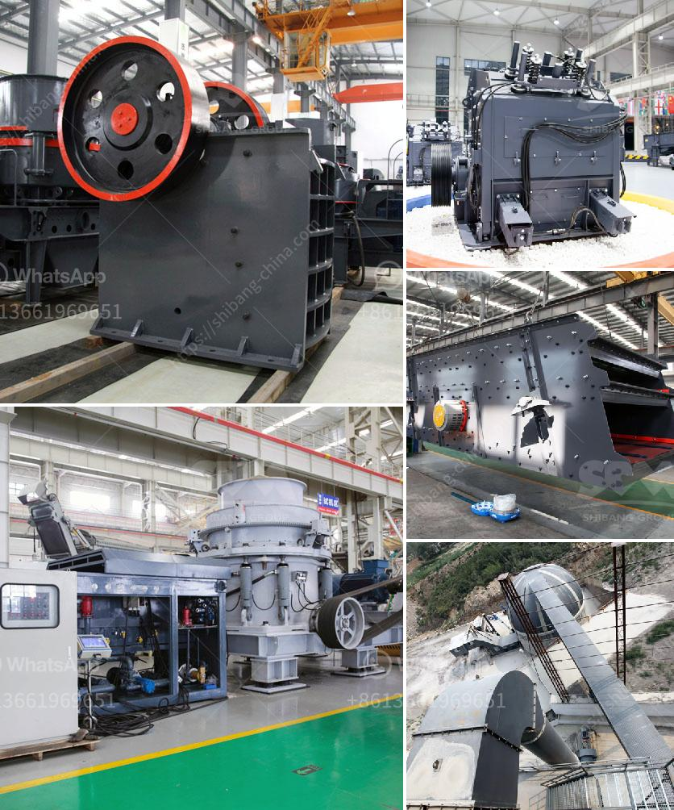

<h3>calcite micron powder grinding machine in thailand</h3>
Calcite is a calcium carbonate mineral, commonly known as limestone or chalk. It is abundant in nature and can be found in various rocks and minerals all over the world. Calcite is widely used in various industries, especially in the construction sector, as a raw material or additive for cement and building materials. To meet the increasing demand for calcite, grinding machines are widely used for processing calcite into micron-sized powders.

In Thailand, the construction industry is one of the key driving forces behind economic growth. With the rapid urbanization and infrastructure development, the demand for construction materials, including calcite powder, is constantly increasing. To fulfill this demand, numerous manufacturers have established grinding mills in Thailand, which specialize in producing various types of calcite powder.

One of the prominent grinding mills in Thailand is the Calcite Micron Powder Grinding Machine. It is a cutting-edge technology that incorporates advanced grinding technology and is fully automated. The machine can grind various minerals and ores with hardness below 7 and moisture content below 6%. Furthermore, it can grind materials into different fineness, ranging from 80-2000 mesh, making it suitable for various applications.

The Calcite Micron Powder Grinding Machine uses high-efficiency pulse dust collector, which can achieve 99% efficiency of dust collection. The machine adopts a three-dimensional structure, which covers a small area and is easy to operate. The machine is equipped with a cylindrical grinding chamber, which is filled with grinding medium (e.g. steel balls or rods). The grinding medium continuously impacts and grinds the calcite particles, resulting in powder of the desired fineness.

The Calcite Micron Powder Grinding Machine is widely used in the grinding process of mineral materials in the metallurgy, building materials, chemicals, mining, and other fields. It produces fine powder of various finenesses, ranging from 80-2000 mesh. This machine is highly efficient and environmentally friendly. It reduces energy consumption by 30-50% compared with traditional grinding machines.

Moreover, the Calcite Micron Powder Grinding Machine is easy to maintain and operate, ensuring low operating costs for the users. Its grinding chamber and parts are made of wear-resistant materials, which greatly prolongs the service life of the machine. Therefore, users can achieve high production efficiency and reduce downtime and maintenance costs.

In conclusion, the Calcite Micron Powder Grinding Machine in Thailand is an innovative grinding equipment with advanced grinding technology and fully automated operation. It is widely used for processing calcite into micron-sized powders for various industries, especially the construction industry. This machine offers high efficiency, low energy consumption, and low operating costs, making it a popular choice among manufacturers in Thailand. With the continuous development and improvement in grinding technology, the Calcite Micron Powder Grinding Machine will play an increasingly important role in the construction industry in Thailand.
<h3>Contact us</h3><ul><li><strong>Whatsapp:&nbsp;<a href="https://wa.me/8613661969651">+8613661969651</a></strong></li><li><a href="https://swt.shibang-china.com/?git&amp;zhl&amp;calcite micron powder grinding machine in thailand"><strong>Online Service(chat now)</strong></a></li></ul><h3>Related</h3><ul><li><a href='used coal wash plant canada for sale.md'>used coal wash plant canada for sale</a></li><li><a href='cement clinker grinding ball mill manufacturer india.md'>cement clinker grinding ball mill manufacturer india</a></li><li><a href='stone crusher machine 120 tonne per hour.md'>stone crusher machine 120 tonne per hour</a></li><li><a href='quarry plant for sale.md'>quarry plant for sale</a></li><li><a href='about aggregate crushing comoany in ethiopia.md'>about aggregate crushing comoany in ethiopia</a></li></ul>