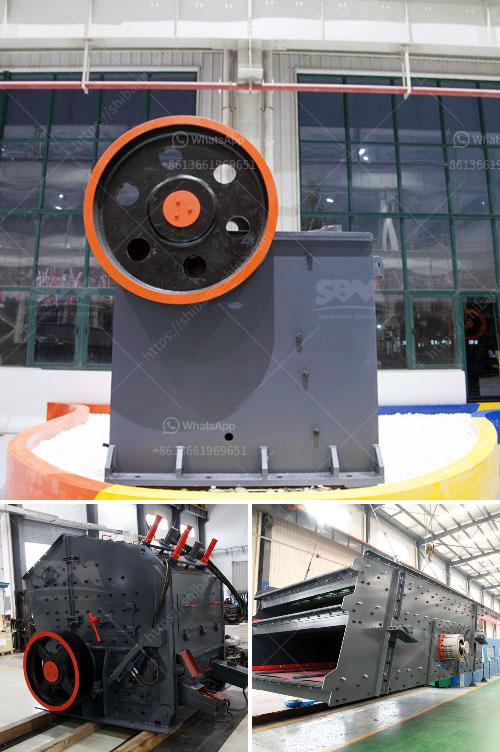

<h3>calcite micronized manufacturing plant pdf</h3>
Calcite is a versatile mineral that is widely used in various industries such as construction, agriculture, and healthcare. It is a form of calcium carbonate that is primarily extracted from limestone and marble deposits. Typically, calcite is ground into a fine powder to achieve specific particle sizes required for different applications. This process of micronization involves reducing the average diameter of calcite particles to a few micrometers, making it more efficient and effective for various uses. In recent years, the demand for micronized calcite has surged due to its unique properties and wide range of applications.

The process of manufacturing micronized calcite involves several steps to ensure a high-quality end product. First, the raw materials are carefully selected and tested for their chemical composition. Only the highest-grade limestone and marble deposits are chosen to ensure the purity and consistency of the final product. These raw materials are then crushed into smaller pieces and subjected to further grinding in mill machines. The grinding process is crucial as it determines the particle size distribution and the quality of the final product.

To achieve the desired particle size, the ground calcite is subjected to advanced technologies such as air classification and separation. This process enables the separation of fine particles from coarser ones, resulting in a well-defined particle size distribution. The micronized calcite is then subjected to rigorous testing in a quality control laboratory to ensure that it meets the specified standards. These tests assess properties such as particle size, whiteness, and chemical composition to determine the suitability for different applications.

The micronized calcite manufacturing plant plays a vital role in meeting the increasing market demand and maintaining a consistent supply of high-quality products. The plant is equipped with state-of-the-art machinery and equipment that ensures efficient and reliable production. The advanced technology employed in the plant enables the production of micronized calcite with a narrow particle size distribution, high whiteness, and excellent chemical purity. This makes it suitable for a wide range of applications such as fillers in paints, plastics, and coatings, as well as extenders in the paper and rubber industries.

Furthermore, the micronized calcite manufacturing plant prioritizes sustainability and environmental responsibility. The waste generated during the production process is minimal and is managed effectively to reduce any adverse impact. The plant also incorporates energy-efficient technologies to reduce energy consumption and carbon emissions. This commitment to sustainability ensures that the manufacturing process is environmentally friendly and supports the global efforts towards a greener future.

In conclusion, the establishment of a calcite micronized manufacturing plant has revolutionized the industry by providing a high-quality, standardized product that meets the diverse needs of various sectors. This plant combines advanced technology, efficient production processes, and a commitment to sustainability to deliver micronized calcite with exceptional properties. As the demand for calcite continues to grow, such manufacturing plants play a crucial role in meeting the growing needs of the industry while promoting environmental stewardship. With their focus on quality and sustainability, these plants are the game-changers in the calcite market, setting new industry standards and paving the way for enhanced applications and possibilities.
<h3>Contact us</h3><ul><li><strong>Whatsapp:&nbsp;<a href="https://wa.me/8613661969651">+8613661969651</a></strong></li><li><a href="https://swt.shibang-china.com/?git&amp;zhl&amp;calcite micronized manufacturing plant pdf"><strong>Online Service(chat now)</strong></a></li></ul><h3>Related</h3><ul><li><a href='stearic acid coating machine for calcium carbonate.md'>stearic acid coating machine for calcium carbonate</a></li><li><a href='crusher plant in philippines.md'>crusher plant in philippines</a></li><li><a href='harga mesin pemecah batu merek jepang.md'>harga mesin pemecah batu merek jepang</a></li><li><a href='used gold crushing for sale in uae.md'>used gold crushing for sale in uae</a></li><li><a href='bentonite and barite milling machines.md'>bentonite and barite milling machines</a></li></ul>