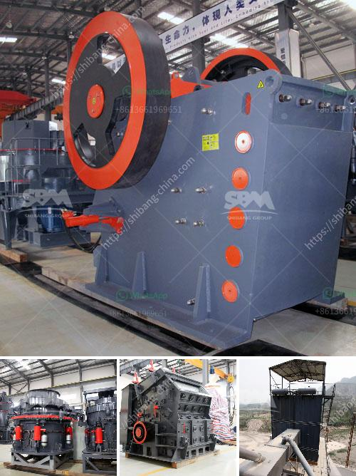

<h3>calcite mining plant</h3>
Calcite, a carbonate mineral, is the most stable polymorph of calcium carbonate (CaCO3). The calcite mineral commonly occurs in limestone, marble, and chalk, which are widely used in construction, manufacturing, and agricultural sectors. With increasing demand for calcite products, many countries have developed calcite mining plant to extract high-quality mineral for various industrial applications.

Calcite mining plant is a key step in the production of calcite powders. While designing a complete calcite mining plant, various factors need to be considered, such as geography, deposit location, ore properties, final product requirements, and so on. Mineralogy experts suggest that the calcite mineral selection process should be based on the following principles:

1. High-purity calcite resource. To ensure the high-quality of calcite powders, the mining plant should be equipped with high-purity calcite resources. In some calcite deposits, impurities such as dolomite, quartz, and clay may exist. Therefore, it is necessary to select ore with high-purity calcite content, which can be achieved through ore sampling and analysis.

2. Stable and reliable mining equipment. The calcite mineral requires mining equipment with higher production efficiency and stability. For long-term mining operations, it is essential to choose reliable brands and high-performance equipment to ensure the continuous production of calcite powders.

3. Efficient calcite crushing and screening plants. Calcite crusher and screen machines are designed to meet the different crushing requirements of customers. The calcite mining equipment features high efficiency, high productivity, and low energy consumption. These machines have helped our clients make high profits.

4. Calcite grinding mill. The calcite powder process is often divided into three stages, including the primary crushing, secondary crushing, and fine crushing stage. The calcite ore should be first crushed with a crusher machine, and then the materials are grinded with grinding mill equipment for grinding. In addition to these, the auxiliary equipment such as vibrating feeder, vibrating screen and belt conveyor should be installed in the calcite crushing plant.

As we all know, the calcite has the almost same content with limestone. According to experts, the calcite quarrying crusher machine can be used as the limestone crusher. SBM professional crusher experts design the calcite crusher machine according this mineral's characteristics. The crushing machine involves jaw crusher and roller crusher. This step is followed by coarse screening to produce half to a single inch lumps for gravels and so on. Jaw crusher is the primary crushing machine it is mainly used to crush the large calcite materials into smaller size. For further smaller size materials, the secondary crusher machine can be used.

Calcite mining and grinding mill processing plant includes crushing stage, grinding stage, and beneficiation stage. The crushing stage involves different types of crusher machines to process the calcite materials into desired size. Calcite grinding mill is suitable for processing medium and low hardness non flammable and explosive brittle materials with the Mohs hardness of 6 or less.

In conclusion, the calcite mining and grinding mill processing plant can bring benefits to various industries, such as cement, chemical, paper making, textile, coating, glass, fiber, etc. The calcite powder is commonly used to fill the blank of rubber, grout, and other materials; calcite processing plant mainly uses jaw crusher, impact crusher, vibrating feeder, vibrating screen, belt conveyor and other processing equipment. The calcite processing plant requires proper manufacturing technology, machining precision, and highly responsible after-sales service to ensure the smooth operation and improvement of customer benefits.
<h3>Contact us</h3><ul><li><strong>Whatsapp:&nbsp;<a href="https://wa.me/8613661969651">+8613661969651</a></strong></li><li><a href="https://swt.shibang-china.com/?git&amp;zhl&amp;calcite mining plant"><strong>Online Service(chat now)</strong></a></li></ul><h3>Related</h3><ul><li><a href='vibrating screens pictures.md'>vibrating screens pictures</a></li><li><a href='portable sand and gravel wash plants for sale.md'>portable sand and gravel wash plants for sale</a></li><li><a href='quartz manufacturing plant in tamilnadu.md'>quartz manufacturing plant in tamilnadu</a></li><li><a href='fine powder grinding machine.md'>fine powder grinding machine</a></li><li><a href='feldspar ball mill in kenya.md'>feldspar ball mill in kenya</a></li></ul>