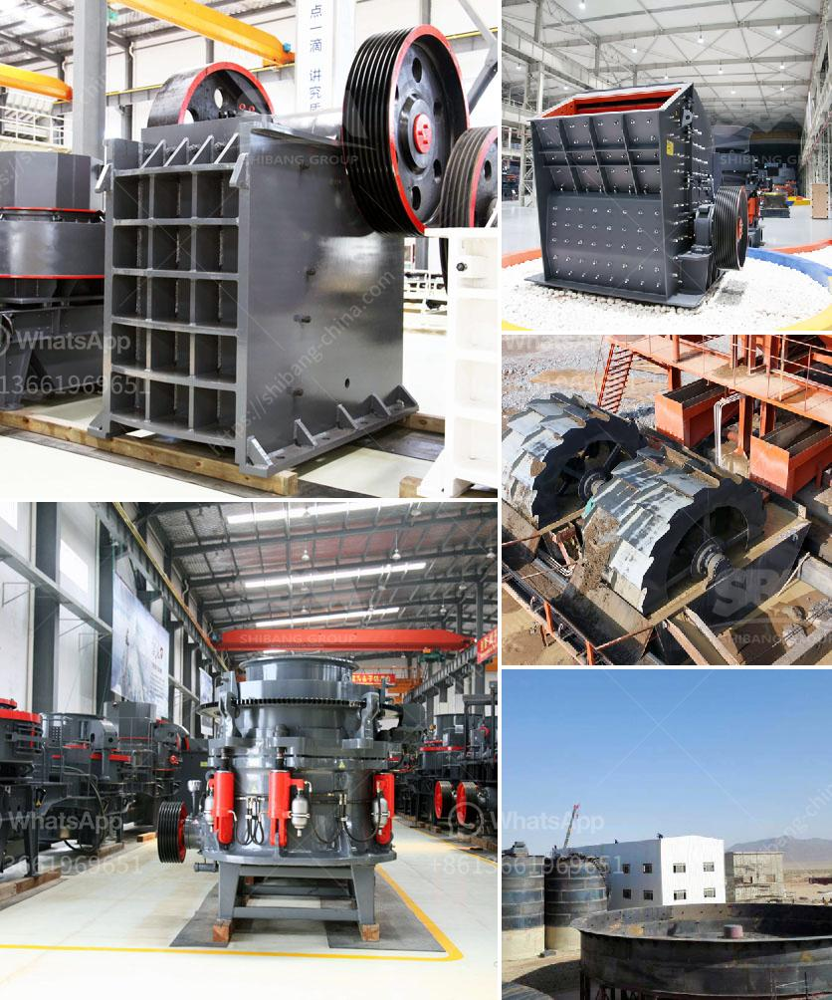

<h3>calcium carbide manufacturing plant</h3>
Calcium carbide is a chemical compound widely used in various industrial applications. It is produced in large quantities through the calcium carbide manufacturing plant. This article aims to provide insights into the production process and significance of a calcium carbide manufacturing plant in industrial processes.

The manufacturing plant facilitates the synthesis of calcium carbide using a combination of lime and coke. The process involves subjecting the raw materials to extremely high temperatures to produce calcium carbide. Typically, the furnace used in the production process is an electric arc furnace, where temperatures reach up to 2000 degrees Celsius.

Firstly, lime, which is calcium oxide (CaO), is crushed into smaller pieces and then mixed with coke, a carbon-rich material derived from coal. The coke provides the necessary carbon content for the chemical reaction. The resulting mixture is then loaded into the furnace, where an electric current is passed through it. This current provides the sufficient heat required for the materials to react and form calcium carbide.

Once the reaction is complete, the calcium carbide is extracted from the furnace in a molten form. The molten calcium carbide is then solidified by pouring it into molds, which are usually shaped like small blocks or pellets. These solidified forms are later crushed into the desired particle sizes, depending on the end-use application.

The manufacturing plant plays a significant role in providing a crucial raw material for various industrial processes. One of the key applications of calcium carbide is in the production of acetylene gas. When calcium carbide comes into contact with water, it undergoes hydrolysis, producing acetylene gas as a byproduct. Acetylene gas is widely used as a fuel source in welding and cutting applications. It provides a high-temperature flame, which is essential for efficient metalworking processes.

Additionally, calcium carbide is utilized in the production of other chemicals, such as polyvinyl chloride (PVC). It is an essential component in the synthesis of PVC resin, a widely used plastic material. Calcium carbide is also employed in the manufacturing of calcium cyanamide, a compound primarily used as a fertilizer. Moreover, it serves as a desulfurizing agent in the steel industry, aiding in the removal of sulfur impurities from iron and steel.

In conclusion, a calcium carbide manufacturing plant is a crucial component in industrial processes due to its role in the production of calcium carbide. The plant utilizes lime and coke to synthesize calcium carbide through a high-temperature process. The resulting calcium carbide is vital in the production of acetylene gas, PVC resin, and calcium cyanamide, among other applications. Its wide range of uses makes calcium carbide a fundamental chemical compound in various industries.
<h3>Contact us</h3><ul><li><strong>Whatsapp:&nbsp;<a href="https://wa.me/8613661969651">+8613661969651</a></strong></li><li><a href="https://swt.shibang-china.com/?git&amp;zhl&amp;calcium carbide manufacturing plant"><strong>Online Service(chat now)</strong></a></li></ul><h3>Related</h3><ul><li><a href='iron crushing equipment price.md'>iron crushing equipment price</a></li><li><a href='method statement for a barite mill.md'>method statement for a barite mill</a></li><li><a href='specification of a ball mill.md'>specification of a ball mill</a></li><li><a href='aggregates plant for construction.md'>aggregates plant for construction</a></li><li><a href='costs of ball mills.md'>costs of ball mills</a></li></ul>