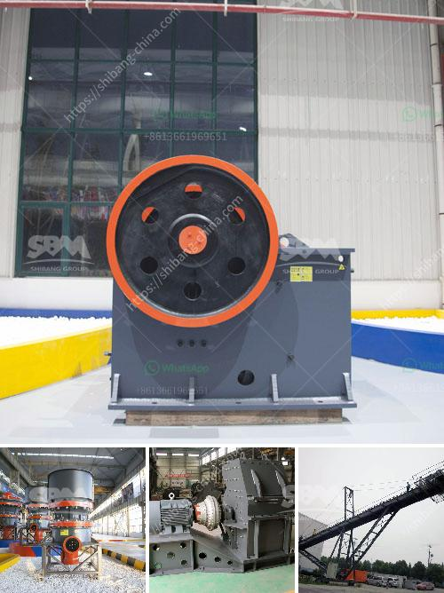

<h3>calcium carbonate crusher</h3>
Calcium carbonate, or CaCO3, is a common mineral found in rocks, seawater, shells of marine organisms, pearls, and eggshells. It is most commonly used in the construction industry as a building material, as well as in various industrial applications.

One of the main uses of calcium carbonate is in the production of cement, where it is added during the grinding process to provide the necessary calcium ions for the formation of the cement compound. In addition, calcium carbonate is also used as a filler in the production of plastics, rubber, and paints, as well as in the production of paper.

To meet the growing demand for calcium carbonate, mining companies have started to utilize calcium carbonate crushers as a cost-effective and efficient way to break down calcium carbonate into smaller usable particles. As a result, these crushers have become a vital tool in the mining industry, as they reduce the size of the rocks and enable them to be processed more easily.

The calcium carbonate crusher works by breaking the ore into small particles that are suitable for the desired industrial applications. There are two types of crushers: primary and secondary. Primary crushers are designed to break down large chunks of rock, whereas secondary crushers are used to break down smaller particles, such as pebbles.

One of the primary crushers used in the mining industry is the jaw crusher. Jaw crushers are capable of crushing large chunks of rock and converting them into smaller particles, making them suitable for secondary crushing. Another popular crusher used for calcium carbonate is the impact crusher. This crusher is used to process larger rocks and convert them into smaller particles or even dust.

The calcium carbonate crusher used in the mining industry is easy to operate and maintain. The equipment has a simple structure, reliable performance, and low operating cost. The jaw crusher is generally used as the primary crusher, as it allows for big input size, and the impact crusher or cone crusher is generally used as the secondary crusher.

After the primary crushing, the calcium carbonate particles are then conveyed to the vibrating screen, where they are sorted and classified based on their size. The smaller-sized particles are sent back to the crusher for further crushing, while the larger particles are processed and used for their intended industrial applications.

In conclusion, calcium carbonate crushers play an important role in the mining industry, as they reduce the size of the rocks and enable them to be processed more easily. These crushers are cost-effective and efficient, providing a valuable tool for mining companies to meet the growing demand for calcium carbonate. With the development of technology, calcium carbonate crushers have become more advanced and allow for easier operation and maintenance. Overall, these crushers contribute to the smooth operation of the mining industry and the production of various industrial products.
<h3>Contact us</h3><ul><li><strong>Whatsapp:&nbsp;<a href="https://wa.me/8613661969651">+8613661969651</a></strong></li><li><a href="https://swt.shibang-china.com/?git&amp;zhl&amp;calcium carbonate crusher"><strong>Online Service(chat now)</strong></a></li></ul><h3>Related</h3><ul><li><a href='mobile crushing plant price.md'>mobile crushing plant price</a></li><li><a href='suppliers of ball mill in bhopal.md'>suppliers of ball mill in bhopal</a></li><li><a href='stone transport belt conveyor.md'>stone transport belt conveyor</a></li><li><a href='harga mesin sekunder stone crusher bekas.md'>harga mesin sekunder stone crusher bekas</a></li><li><a href='cone crusher mobile uk.md'>cone crusher mobile uk</a></li></ul>