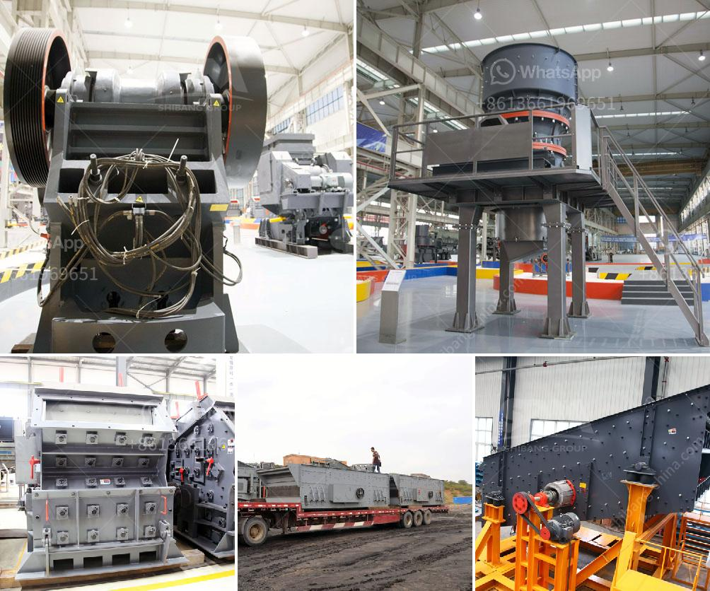

<h3>calcium carbonate in kenya</h3>
Calcium carbonate in Kenya has proven to be a valuable resource for various industries and agricultural practices. Found in abundance in the country, calcium carbonate is composed of calcium, carbon, and oxygen, making it one of the most versatile minerals used across the globe.

In Kenya, calcium carbonate is primarily utilized in the construction industry. Its natural occurrence, coupled with its abundance, makes it an affordable alternative for construction purposes. It is commonly used as a filler material in the manufacture of cement and concrete, due to its ability to enhance the strength and durability of these materials. Calcium carbonate is also used as a coating agent for roads and highways to improve their resistance to wear and tear.

Apart from construction, calcium carbonate plays a crucial role in agriculture. It is widely used as a soil amendment to correct the pH balance and enhance nutrient availability in acidic soils. Farmers in Kenya use calcium carbonate to neutralize the acidity of the soil, thereby improving crop yields. Additionally, it provides an essential source of calcium to plants, which is crucial for the development of strong cell walls and healthy growth.

The mining and manufacturing of calcium carbonate in Kenya also drive economic growth and job creation. Several companies extract calcium carbonate from various deposits in the country, providing employment opportunities for locals. These companies often export the mineral to international markets, generating revenue for the nation.

Furthermore, calcium carbonate has several other applications, including in the pharmaceutical industry for manufacturing antacids and calcium supplements, and in the paper industry as a filler and brightening agent for paper products.

In conclusion, calcium carbonate plays a significant role in various industries and agricultural practices in Kenya. With its abundance and affordability, the mineral has become an essential resource for construction, agriculture, and other sectors. The mining and manufacturing of calcium carbonate not only contribute to the economy but also provide employment opportunities. Overall, calcium carbonate stands as a valuable asset for Kenya's development and growth.
<h3>Contact us</h3><ul><li><strong>Whatsapp:&nbsp;<a href="https://wa.me/8613661969651">+8613661969651</a></strong></li><li><a href="https://swt.shibang-china.com/?git&amp;zhl&amp;calcium carbonate in kenya"><strong>Online Service(chat now)</strong></a></li></ul><h3>Related</h3><ul><li><a href='jaw crusher refurbished.md'>jaw crusher refurbished</a></li><li><a href='jaw crushers machine for sale.md'>jaw crushers machine for sale</a></li><li><a href='jaw crusher in south africa.md'>jaw crusher in south africa</a></li><li><a href='price list of used stone crushers in kenya.md'>price list of used stone crushers in kenya</a></li><li><a href='calcium carbonate plant layout diagram.md'>calcium carbonate plant layout diagram</a></li></ul>