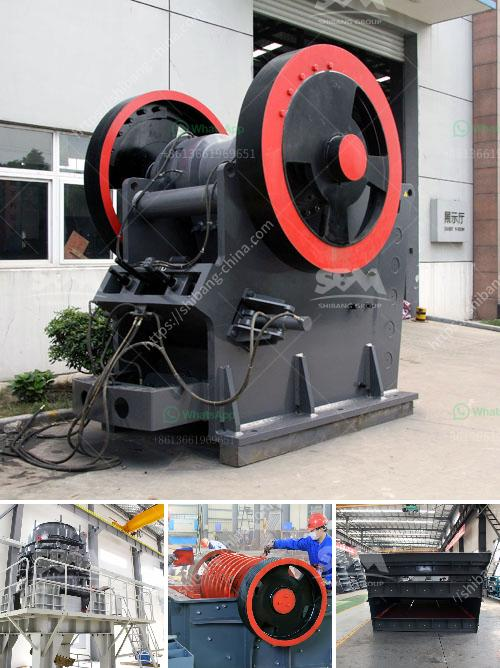

<h3>calcium carbonate machine</h3>
Calcium carbonate is a versatile mineral that has many uses in various industries. It is commonly used as a filler and coating material in papermaking, as well as a component in the production of cement, lime, and glass. In recent years, the demand for calcium carbonate has been increasing, leading to the development of advanced machinery for its production.

A calcium carbonate machine is a machine that is used to produce calcium carbonate powder. The machine uses mechanical energy to compress and grind large chunks of calcium carbonate into fine powder. The particles of calcium carbonate produced are typically spherical in shape and are commonly used in various applications such as plastic, rubber, and cement-making.

The calcium carbonate machine consists of a crushing chamber, a grinding chamber, a feed inlet, a grinding roller assembly, and a discharge outlet. The machine operates by feeding the calcium carbonate chunks into the crushing chamber, which contains a rotating hammer that crushes the particles into smaller sizes. The crushed particles then pass into the grinding chamber, which contains a series of grinding rollers. The grinding rollers rotate and exert pressure on the particles, causing them to grind against the grinding chamber’s walls and each other. This grinding action further reduces the size of the particles, resulting in fine calcium carbonate powder.

One of the key components of a calcium carbonate machine is the grinding roller assembly. The grinding rollers are typically made of durable materials such as high-quality steel or hard alloy. They are designed to withstand the high pressure exerted during the grinding process and ensure efficient and uniform grinding of the calcium carbonate particles.

Another important feature of a calcium carbonate machine is the discharge outlet. The discharge outlet is responsible for collecting the ground calcium carbonate powder and separating it from the air and other impurities. The discharge outlet is usually equipped with a pollen filter or a cyclone collector that helps to remove any fine particles in the air, ensuring that only the pure calcium carbonate powder is collected.

The size and capacity of a calcium carbonate machine can vary depending on the requirements of the production process. Smaller machines are suitable for small-scale production or laboratory use, while larger machines are designed for commercial production. Some machines are also equipped with additional features such as automatic feeding and discharging systems, as well as advanced control systems for precise and efficient operation.

In conclusion, a calcium carbonate machine is an essential tool for producing high-quality calcium carbonate powder. The machine utilizes mechanical energy to crush and grind calcium carbonate chunks into fine powder, which is then used in various industries. With advancements in technology, modern calcium carbonate machines offer improved efficiency, precision, and automation, making them an indispensable asset in the calcium carbonate production process.
<h3>Contact us</h3><ul><li><strong>Whatsapp:&nbsp;<a href="https://wa.me/8613661969651">+8613661969651</a></strong></li><li><a href="https://swt.shibang-china.com/?git&amp;zhl&amp;calcium carbonate machine"><strong>Online Service(chat now)</strong></a></li></ul><h3>Related</h3><ul><li><a href='slag crushing machine hopper in india.md'>slag crushing machine hopper in india</a></li><li><a href='ball mill grinding media.md'>ball mill grinding media</a></li><li><a href='barytes processing equipment.md'>barytes processing equipment</a></li><li><a href='lime dolomite plant processing.md'>lime dolomite plant processing</a></li><li><a href='ball mill for limestone.md'>ball mill for limestone</a></li></ul>