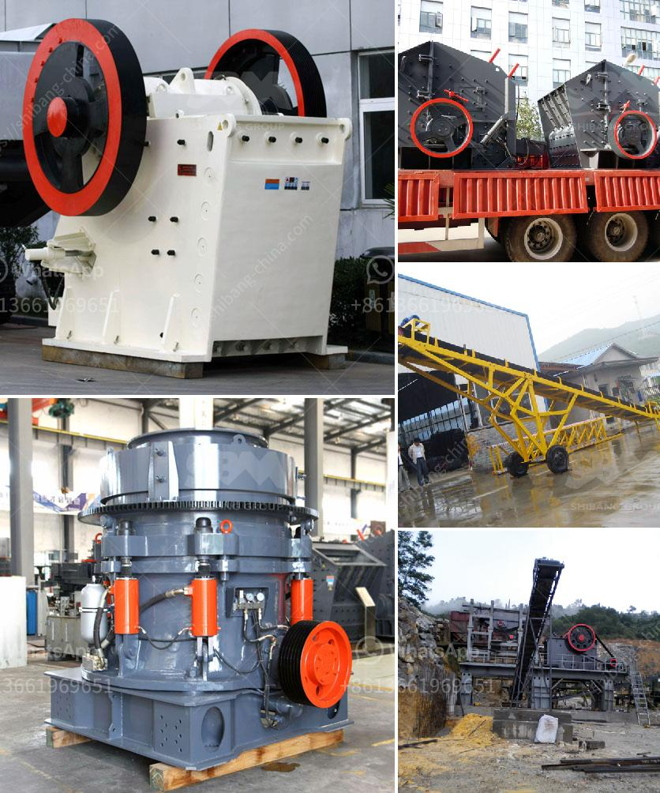

<h3>calcium carbonate manufacturing machine</h3>
Calcium carbonate is a compound commonly found in rocks, shells, and the skeletons of marine organisms. It is widely used in various industries such as construction, agriculture, and pharmaceuticals due to its diverse range of properties. The manufacturing process of calcium carbonate involves crushing, grinding, and heat treatment of limestone or marble, resulting in the formation of calcium oxide and carbon dioxide gas. These are then combined to produce calcium carbonate.

To meet the growing demand for calcium carbonate, specialized machines are used in its manufacturing process. A calcium carbonate manufacturing machine is a sophisticated piece of machinery that is used by industrial plants to produce high-quality calcium carbonate products. These machines ensure a higher level of precision, efficiency, and consistency in the manufacturing process, resulting in superior product quality.

One commonly used machine in calcium carbonate manufacturing is the ball mill. The ball mill is a versatile and efficient grinding machine that is capable of grinding and homogenizing various materials to produce calcium carbonate particles of different sizes. The machine operates by rotating a cylinder filled with calcium carbonate and steel balls. As the cylinder rotates, the steel balls collide with the calcium carbonate particles, resulting in a fine powder.

Another important machine in calcium carbonate manufacturing is the classifier. The classifier is used to separate the calcium carbonate particles of different sizes based on their specific gravity. This enables the production of calcium carbonate products with a consistent particle size distribution, ensuring uniformity in the end product.

Furthermore, advanced technologies such as air classifiers and ultrafine mills are used in the manufacturing process to produce ultrafine calcium carbonate particles, which find applications in high-value markets such as paper, paint, plastics, and coatings.

In conclusion, calcium carbonate manufacturing machines play a crucial role in the efficient production of calcium carbonate products. These machines ensure a high level of precision, consistency, and efficiency in the manufacturing process, resulting in superior product quality. With the advancements in technology, manufacturers are able to produce a wide range of calcium carbonate products that cater to various industries and applications.
<h3>Contact us</h3><ul><li><strong>Whatsapp:&nbsp;<a href="https://wa.me/8613661969651">+8613661969651</a></strong></li><li><a href="https://swt.shibang-china.com/?git&amp;zhl&amp;calcium carbonate manufacturing machine"><strong>Online Service(chat now)</strong></a></li></ul><h3>Related</h3><ul><li><a href='quartz grinding ball mill.md'>quartz grinding ball mill</a></li><li><a href='the biggest crusher manufacturer in china.md'>the biggest crusher manufacturer in china</a></li><li><a href='ball mills in monterrey.md'>ball mills in monterrey</a></li><li><a href='clinker grinding plant setup cost in india.md'>clinker grinding plant setup cost in india</a></li><li><a href='calculation of crushing plant.md'>calculation of crushing plant</a></li></ul>