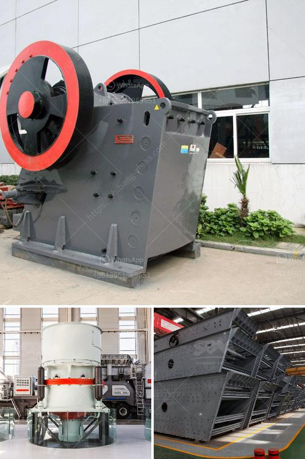

<h3>calcium carbonate mill</h3>
Calcium carbonate is a commonly used mineral in many different industries, ranging from construction to pharmaceuticals. It is a white, odorless powder and is derived from limestone, marble, or chalk. One of the main applications of calcium carbonate is in the production of paper, where it is used as a filler and coating pigment, improving the brightness and opacity of the final product.

To produce calcium carbonate, it must go through a milling process. The calcium carbonate mill is a type of grinding machine that enables the materials to be ground to different fineness. With the continuous development of the industry, there has been a growing demand for calcium carbonate, which has prompted the manufacturers to develop various types of grinding machines to meet this demand.

The calcium carbonate mill consists of a rotating cylindrical container filled with balls, cascading down from the top, causing the material to be ground by impact and attrition forces. The grinding media in the mill can vary depending on the specific application, for example, ceramic balls, flint pebbles, or stainless steel balls. The size and composition of the grinding media play a crucial role in achieving the desired particle size distribution and properties of the final product.

One example of a calcium carbonate mill is the ball mill. This type of mill is commonly used in the pharmaceutical industry for the production of powders with a specific particle size distribution. The ball mill works on the principle of impact and attrition: the material is placed inside a hollow cylinder, which is partially filled with balls. As the cylinder rotates, the balls collide with the material, resulting in size reduction.

Another type of calcium carbonate mill is the ultrafine mill. This mill is designed for producing fine and ultrafine powders with a high degree of fineness. The ultrafine mill uses a combination of impact, attrition, and fluid shear forces to achieve the desired particle size reduction. The finely ground calcium carbonate particles are then collected and classified by size using air classifiers.

In addition to the ball mill and the ultrafine mill, there are also other types of calcium carbonate mills available, such as the Raymond mill and the vertical roller mill. Each of these mills has its own advantages and specific applications, depending on the desired particle size and properties of the final product.

In conclusion, the calcium carbonate mill is an essential machine in the production of calcium carbonate powders. Its various types, such as the ball mill and the ultrafine mill, offer different capabilities and advantages for achieving the desired particle size and properties. With the growing demand for calcium carbonate in various industries, the development of efficient and versatile grinding machines is crucial for meeting this demand and ensuring the quality of the final products.
<h3>Contact us</h3><ul><li><strong>Whatsapp:&nbsp;<a href="https://wa.me/8613661969651">+8613661969651</a></strong></li><li><a href="https://swt.shibang-china.com/?git&amp;zhl&amp;calcium carbonate mill"><strong>Online Service(chat now)</strong></a></li></ul><h3>Related</h3><ul><li><a href='used stone crusher machine japan.md'>used stone crusher machine japan</a></li><li><a href='crusher plant project cost.md'>crusher plant project cost</a></li><li><a href='marble jaw crusher.md'>marble jaw crusher</a></li><li><a href='price pe 600 and 900 stone crusher.md'>price pe 600 and 900 stone crusher</a></li><li><a href='limestone crusher kenya.md'>limestone crusher kenya</a></li></ul>