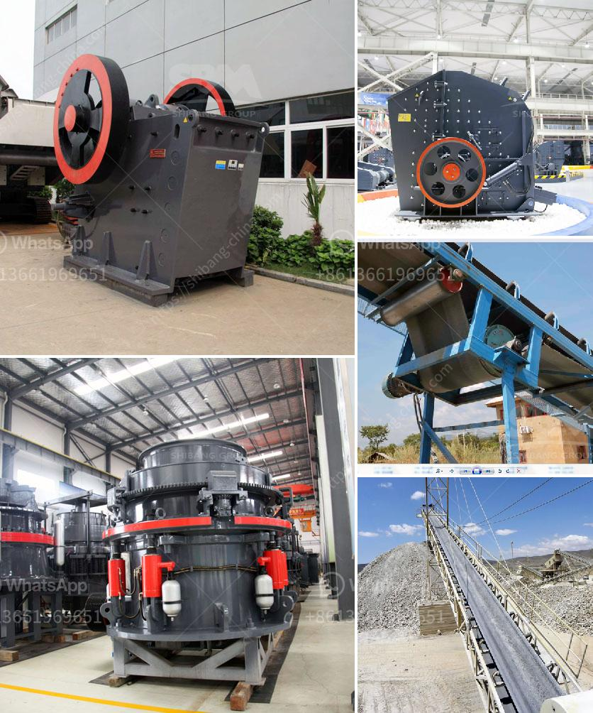

<h3>calcium carbonate plant layout diagram</h3>
Calcium carbonate is a commonly used filler and coating material in industries such as plastics, paints, and adhesives. However, it is also used for various other applications, such as in the production of paper, rubber, and glass. To meet the increasing demand for calcium carbonate, plant operators must implement an efficient and well-designed layout to streamline production and ensure optimum productivity. In this article, we will discuss the elements of a calcium carbonate plant layout diagram.

The first crucial element in a calcium carbonate plant layout diagram is the primary crushing area. This is where large blocks of limestone are crushed into smaller particles to produce calcium carbonate powder. A vibrating feeder evenly feeds the material into a jaw crusher for primary crushing. The crushed materials are then conveyed to a secondary cone crusher for further size reduction.

From the secondary cone crusher, the crushed materials are sent to a vibrating screen. The vibrating screen separates the various sizes of calcium carbonate particles. Oversized particles are returned to the secondary cone crusher for further crushing, while properly sized particles move forward in the process.

Next in the calcium carbonate plant layout diagram is the milling area. Here, the calcium carbonate particles are ground into a fine powder using a pulverizing mill. The mill consists of a rotating drum with steel balls inside, which grind the particles to the desired fineness. The powdered calcium carbonate is then transferred to a silo, where it is stored temporarily before packaging or further processing.

After milling, the calcium carbonate powder goes through a classification process in the classification area. This step separates the powder into different grades based on particle size. The classified calcium carbonate is collected in separate bins or silos, ready to be packaged or transported to other processing facilities.

In addition to the primary crushing, milling, and classification areas, a calcium carbonate plant layout diagram typically includes auxiliary equipment and facilities. This may include a dust collector system to capture and filter any airborne particles generated during the crushing and milling processes. A storage and handling system is also essential for storing and transporting the calcium carbonate powder safely.

Furthermore, a laboratory area is necessary for quality control and product testing. This is where samples of the calcium carbonate powder are analyzed for various specifications, such as particle size, brightness, and chemical composition. The results from the laboratory tests help ensure that the produced calcium carbonate meets the required standards and customer expectations.

Overall, designing a calcium carbonate plant layout diagram involves careful consideration of various factors, including the desired production capacity, quality control measures, and safety regulations. By implementing an efficient and well-designed layout, plant operators can optimize production, reduce operational costs, and maintain a high-quality product.
<h3>Contact us</h3><ul><li><strong>Whatsapp:&nbsp;<a href="https://wa.me/8613661969651">+8613661969651</a></strong></li><li><a href="https://swt.shibang-china.com/?git&amp;zhl&amp;calcium carbonate plant layout diagram"><strong>Online Service(chat now)</strong></a></li></ul><h3>Related</h3><ul><li><a href='drawing for sand washing machines crusher mill.md'>drawing for sand washing machines crusher mill</a></li><li><a href='chromite ore crushing machine.md'>chromite ore crushing machine</a></li><li><a href='cost of cone crusher.md'>cost of cone crusher</a></li><li><a href='nigeria stone grinder mill.md'>nigeria stone grinder mill</a></li><li><a href='cost of bentonite manufacturing processing plant.md'>cost of bentonite manufacturing processing plant</a></li></ul>