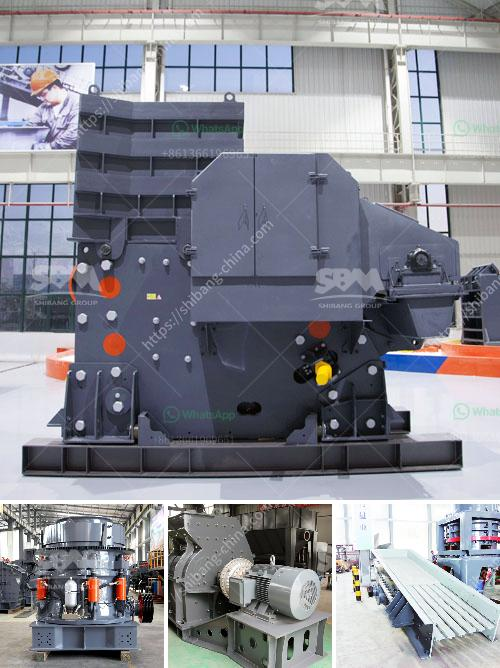

<h3>calcium carbonate production</h3>
Calcium carbonate, commonly known as limestone, is an essential mineral that is found in abundant quantities around the world. Its most common natural forms are chalk, limestone, and marble, produced by the sedimentation of the shells of small fossilized snails, shellfish, and coral over millions of years.

The production of calcium carbonate involves a complex process of mining, grinding, separating, and refining. It is used to produce a wide range of industrial and consumer products. In this article, we will explore the production process of calcium carbonate and its importance in various industries.

The mining process for calcium carbonate starts with the extraction of limestone from quarries. These quarries utilize heavy equipment, such as bulldozers, backhoes, loaders, and dump trucks, to remove the limestone from the ground. The extracted limestone is then transported to a crushing plant to reduce its size before being shipped to grinding mills, where it is further processed.

In the grinding mills, calcium carbonate particles are pulverized into a fine powder through mechanical or chemical means, depending on the desired particle size. The ground calcium carbonate is then classified through a series of screens to separate different particle sizes for various applications.

After the sorting process, calcium carbonate undergoes a refining process to remove impurities and enhance its purity. Various techniques, such as flotation, magnetic separation, and chemical treatments, are employed to purify calcium carbonate and achieve the desired quality.

Once the calcium carbonate is refined, it is ready for use in various industries. One of the most significant applications of calcium carbonate is in the manufacturing of paper. It is added to paper pulp to increase its brightness and opacity, resulting in high-quality printing paper.

Calcium carbonate is also widely used in the production of plastics. It acts as a filler material, increasing the strength and stiffness of plastics, while also reducing their cost. Additionally, calcium carbonate can be used as a coating in the paper and plastic industries, further enhancing the performance and appearance of these products.

The construction industry is another major consumer of calcium carbonate. It is used as a building material, particularly in the production of cement, concrete, and mortar. The addition of calcium carbonate improves the strength and durability of these construction materials, making them suitable for various applications.

Moreover, calcium carbonate is an essential ingredient in the production of paints, coatings, and adhesives. It acts as a pigment and filler, improving the color, opacity, and viscosity of these products. Additionally, calcium carbonate can also be found in toothpaste, pharmaceuticals, food supplements, and many other consumer products.

In conclusion, calcium carbonate production plays a crucial role in various industries, providing essential materials for construction, manufacturing, and consumer goods. From paper production to plastic manufacturing, calcium carbonate enhances the properties and performance of numerous products. Although the production process is complex and involves various stages of refining, it is a highly valuable mineral that is essential for the functioning of modern society.
<h3>Contact us</h3><ul><li><strong>Whatsapp:&nbsp;<a href="https://wa.me/8613661969651">+8613661969651</a></strong></li><li><a href="https://swt.shibang-china.com/?git&amp;zhl&amp;calcium carbonate production"><strong>Online Service(chat now)</strong></a></li></ul><h3>Related</h3><ul><li><a href='stone crusher machine prices.md'>stone crusher machine prices</a></li><li><a href='conveyor belts in east africa.md'>conveyor belts in east africa</a></li><li><a href='100tph stone crusher plant.md'>100tph stone crusher plant</a></li><li><a href='cone crusher manufacturers for sale in italy.md'>cone crusher manufacturers for sale in italy</a></li><li><a href='metal crusher for sale in turkey.md'>metal crusher for sale in turkey</a></li></ul>