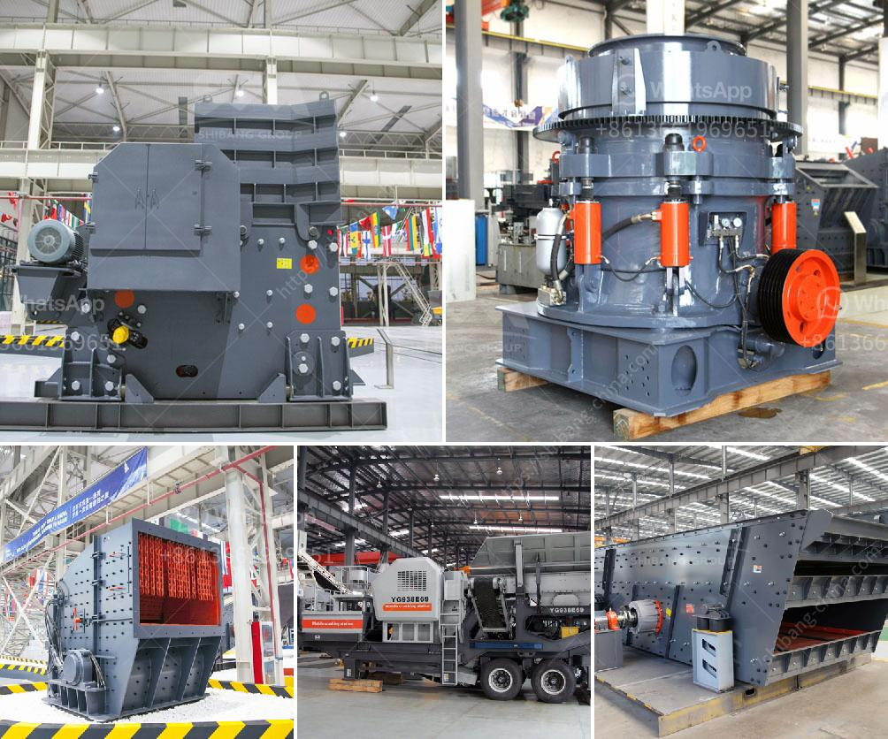

<h3>calcium carbonate rock crusher</h3>
Calcium carbonate, a kind of inorganic compound, is a main component of limestone, which is a rock crusher for calcium carbonate. Some types of calcium carbonate rock crusher can be found in the sedimentary rocks, which are created by the remains of plants, animals, and fossils over time. Calcium carbonate, in its purest form, is a white powder and is commonly used as a filler in the manufacturing of various products, such as paper, plastics, paints, and rubber.

When considering the extraction of calcium carbonate rock, one of the primary tools used is the rock crusher. Calcium carbonate combines with carbonate ions to form limestone, which is primarily composed of calcite, a mineral commonly found in sedimentary rocks.

The calcium carbonate rock crusher breaks down the rocks into smaller pieces to facilitate the extraction process. The crusher uses either a mechanical or a hydraulic process to achieve this. Mechanical crushers use a hammer, which continuously impacts the rock until it breaks into smaller pieces. Hydraulic crushers, on the other hand, apply pressure to the rock until it is crushed.

The crushed calcium carbonate rock is then processed further to obtain the desired particle size. This can be achieved through several methods, including grinding, pulverizing, or milling. The particle size of the final product can range from coarse to fine, depending on its intended use.

One of the main applications of calcium carbonate rock crusher is in the construction industry. It is commonly used as a building material, as it provides strength and durability to structures. It is also used as an aggregate in the production of concrete, enhancing its strength and resistance to wear and tear.

In addition to its applications in construction, calcium carbonate rock crusher is also used in the manufacturing industry. It can be found in various products, such as paints, plastics, and rubber. In paints, it acts as a filler to improve the texture and consistency of the paint. In plastics, it enhances the strength and rigidity of the material. In rubber, it improves its elasticity and resistance to wear.

Furthermore, calcium carbonate rock crusher has environmental benefits. It is a natural resource that can be extracted sustainably, as new deposits of calcium carbonate are constantly being formed. Additionally, it is a non-toxic substance that does not pose any health risks to humans or the environment.

In conclusion, calcium carbonate rock crusher plays a crucial role in the extraction and processing of calcium carbonate, a key component of limestone. It is widely used in the construction and manufacturing industries, providing strength, durability, and other beneficial properties to various products. Moreover, its extraction and use have minimal environmental impact, making it a sustainable choice for the future.
<h3>Contact us</h3><ul><li><strong>Whatsapp:&nbsp;<a href="https://wa.me/8613661969651">+8613661969651</a></strong></li><li><a href="https://swt.shibang-china.com/?git&amp;zhl&amp;calcium carbonate rock crusher"><strong>Online Service(chat now)</strong></a></li></ul><h3>Related</h3><ul><li><a href='roller mill ultrafine.md'>roller mill ultrafine</a></li><li><a href='dry processing of coal in south africa.md'>dry processing of coal in south africa</a></li><li><a href='how much crusher plant cost.md'>how much crusher plant cost</a></li><li><a href='how to start a stone crushing company in canada.md'>how to start a stone crushing company in canada</a></li><li><a href='crushing machines for sale.md'>crushing machines for sale</a></li></ul>