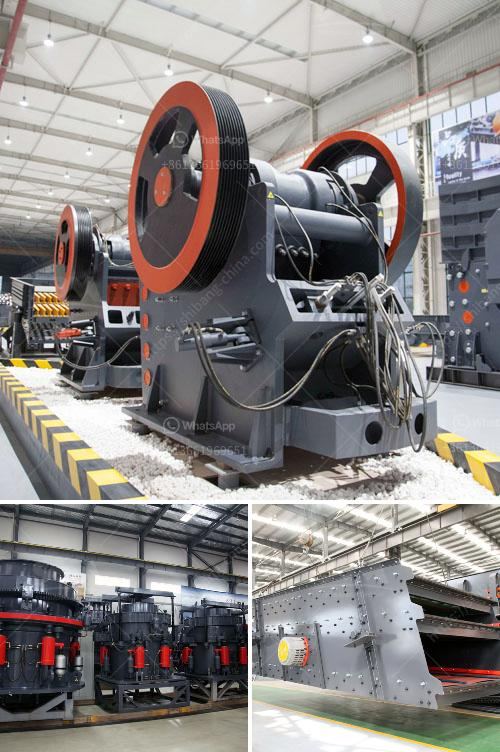

<h3>calcium carbonated crusher mill china</h3>
When it comes to calcium carbonate, the process of extracting, grinding, and refining the mineral is essential for obtaining the purest form of the compound. Calcium carbonate crusher mill China plays a crucial role in this process, as it breaks down larger chunks of limestone into smaller pieces, making the extraction and refining of calcium carbonate more efficient.

Calcium carbonate is one of the most abundant minerals found in nature, primarily in the form of limestone. Limestone deposits can be found all around the world, and China is known for its vast reserves of this mineral. To extract calcium carbonate from these deposits, the quarrying process is used.

The first step in the quarrying process is to locate a suitable limestone deposit. Once the deposit has been identified, mining operations begin to extract the limestone using various techniques. Explosives are used to break apart the limestone into manageable sizes, which can vary from small boulders to larger chunks depending on the specific quarry.

After the limestone has been extracted from the quarry, it is transported to a crushing plant where it goes through primary crushing. Here, the calcium carbonate crusher mill China comes into play. This machine is specially designed to crush and grind the raw limestone into fine powder, allowing for easy processing and refinement in subsequent steps.

The calcium carbonate crusher mill China operates by utilizing rotating hammers or steel balls to break limestone down into smaller pieces. These smaller pieces are then conveyed to a secondary crusher, where they are further crushed and refined. This grinding process ensures that the limestone is broken down to the desired size for further processing.

After the calcium carbonate has been crushed and ground, it goes through a refining process to remove impurities and obtain the highest purity possible. This refining process involves various techniques, such as flotation, sedimentation, and filtration. These techniques separate impurities from the calcium carbonate, resulting in a pure and high-quality product.

China is a leading producer of calcium carbonate, and the country's advanced manufacturing capabilities have allowed it to develop state-of-the-art crushers and mills. These machinery are designed to efficiently break down limestone, resulting in a high-volume production of calcium carbonate.

Furthermore, China's extensive industrial infrastructure enables the country to produce and supply calcium carbonate on a large scale. This makes China a key player in meeting global demand for this essential mineral, which is used in various industries such as construction, paper manufacturing, and pharmaceuticals.

In conclusion, the calcium carbonate crusher mill China plays a vital role in the quarrying process, ensuring that large chunks of limestone are broken down into smaller pieces that are suitable for extraction and refining. This sophisticated machinery enables China to be a major producer and supplier of calcium carbonate, meeting the diverse demands of industries worldwide. With ongoing advancements and innovations, China continues to lead the way in calcium carbonate production, ensuring the availability of this essential compound for various applications.
<h3>Contact us</h3><ul><li><strong>Whatsapp:&nbsp;<a href="https://wa.me/8613661969651">+8613661969651</a></strong></li><li><a href="https://swt.shibang-china.com/?git&amp;zhl&amp;calcium carbonated crusher mill china"><strong>Online Service(chat now)</strong></a></li></ul><h3>Related</h3><ul><li><a href='mica powder machine in pakistan.md'>mica powder machine in pakistan</a></li><li><a href='thailand granite quarry crusher.md'>thailand granite quarry crusher</a></li><li><a href='quotation for iron ore processing.md'>quotation for iron ore processing</a></li><li><a href='granite crusher machine.md'>granite crusher machine</a></li><li><a href='bentonite clay crusher for sale.md'>bentonite clay crusher for sale</a></li></ul>