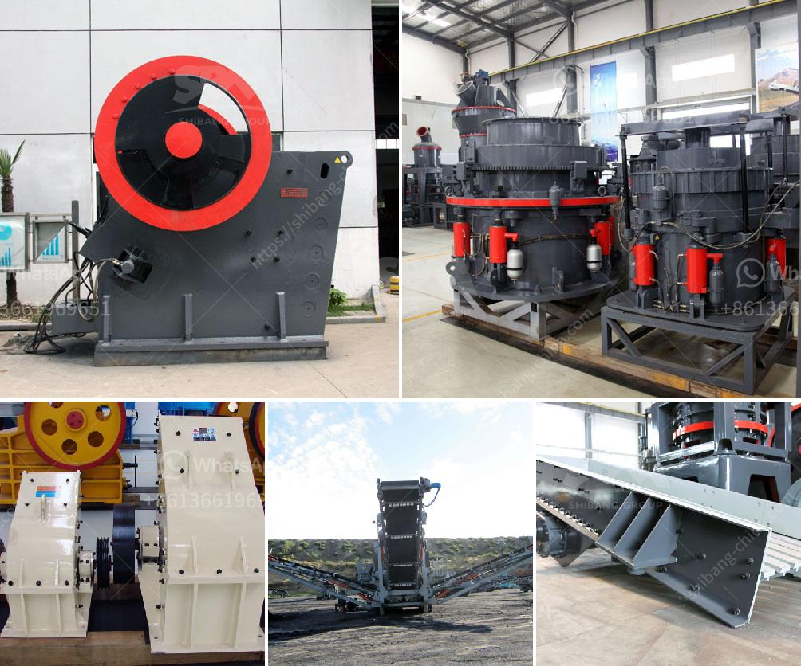

<h3>calcium oxide crusher</h3>
Calcium oxide, also known as quicklime, is a versatile chemical compound that finds widespread applications in various industries. Its primary use is in the production of cement, steel, and building materials. To obtain calcium oxide, the mineral limestone undergoes a process called calcination. This involves heating the raw material at extremely high temperatures to drive off carbon dioxide, leaving behind calcium oxide.

In the production of cement, calcium oxide plays a crucial role in the formation of clinker. Clinker is a key component in the manufacturing of cement and is obtained by heating a mixture of limestone and other materials to a temperature of around 1500 degrees Celsius. The resulting clinker is then ground into a fine powder to produce cement.

Calcium oxide also has applications in the steel industry. In the process of steelmaking, calcium oxide is used as a flux agent to remove impurities such as silica and alumina from the ore. The addition of calcium oxide helps in the formation of slag, a byproduct that can be easily separated from the molten metal, resulting in purer steel.

Another major application of calcium oxide is in the construction industry. It is used as a binder for various building materials, including bricks, mortar, and plaster. When calcium oxide reacts with water, it undergoes a process known as hydration, in which it forms calcium hydroxide. This chemical reaction generates heat, and the resulting calcium hydroxide acts as a binding agent, providing strength and stability to the construction materials.

With such wide-ranging applications, the demand for calcium oxide is significant in various industries. To meet this demand, specialized equipment, such as calcium oxide crushers, are employed in the processing of raw materials.

A calcium oxide crusher is a machine designed to reduce large-sized raw materials into smaller pieces. These machines are widely used in various industries, such as cement, steel, and construction. The crushing process involves multiple stages, starting with the initial breaking down of the raw material, followed by further crushing and grinding.

In terms of design, calcium oxide crushers typically feature a heavy-duty construction, with robust components that can withstand the high stresses associated with the crushing process. They are equipped with powerful motors and strong crushing jaws or hammers, depending on the specific application. These machines can handle a wide range of materials, including limestone, clay, and other minerals commonly used in cement production or steelmaking.

The use of calcium oxide crushers not only ensures the efficient production of calcium oxide but also offers several other benefits. By reducing the size of raw materials, crushers facilitate easier processing and handling of materials, resulting in improved efficiency and reduced transportation costs. Additionally, crushers help to ensure uniform particle size, which is crucial in achieving the desired chemical and physical properties in the end product.

In conclusion, calcium oxide crushers are indispensable machines in various industries, providing the essential function of reducing large-sized raw materials into smaller particles. With their robust design and powerful capabilities, these machines play a vital role in the production of cement, steel, and other building materials. The versatility and wide-ranging applications of calcium oxide make it a crucial compound in our modern industrial landscape, and its production heavily relies on the efficient operation of crushers.
<h3>Contact us</h3><ul><li><strong>Whatsapp:&nbsp;<a href="https://wa.me/8613661969651">+8613661969651</a></strong></li><li><a href="https://swt.shibang-china.com/?git&amp;zhl&amp;calcium oxide crusher"><strong>Online Service(chat now)</strong></a></li></ul><h3>Related</h3><ul><li><a href='cost of graphite processing plant.md'>cost of graphite processing plant</a></li><li><a href='project cost estimation for iron ore pellet plant.md'>project cost estimation for iron ore pellet plant</a></li><li><a href='ball clay crusher manufacturing process.md'>ball clay crusher manufacturing process</a></li><li><a href='gold mining equipment washing machines.md'>gold mining equipment washing machines</a></li><li><a href='price of quarry crusher in zimbabwe.md'>price of quarry crusher in zimbabwe</a></li></ul>