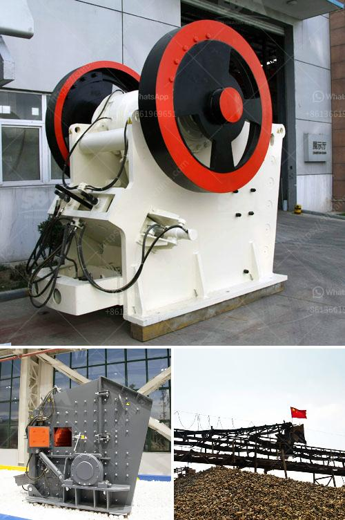

<h3>calculation of crushing plant</h3>
Calculating the efficiency of a crushing plant is a complex and time-consuming process. The art and science of plant design rely on various calculations to estimate the performance of equipment, capacity needs, power requirements, and other factors. While it may seem daunting at first, understanding the calculations involved can help optimize the overall efficiency of a crushing plant and maximize productivity.

One of the key calculations in designing a crushing plant is the determination of the power requirements. This is typically done by using Bond's work index equation, which relates the power consumption of the crusher to the material size reduction ratio. The equation takes into account the feed size, the product size, and the material's compressive strength. By knowing the power requirements, plant operators can choose suitable crushers and optimize their energy usage.

Another important calculation is the determination of the machine capacity. This involves estimating the maximum amount of material that can be processed by the equipment per unit of time. This calculation considers factors such as the crusher's throw, eccentric speed, and chamber design. It also accounts for the characteristics of the material being processed, including its density, abrasiveness, and moisture content. By accurately estimating the machine capacity, plant operators can ensure uninterrupted production and avoid bottlenecks.

Additionally, the calculation of the circulating load in the crushing circuit is crucial. The circulating load represents the amount of material that bypasses the crusher and circulates back to the screening and crushing stages. A high circulating load can lead to excessive wear on the equipment and lower overall plant efficiency. By properly calculating the circulating load, plant operators can optimize the performance of the crushing circuit and reduce energy consumption.

Furthermore, the calculation of the screen efficiency is vital in assessing the overall performance of a crushing plant. The screen is responsible for separating the material into different sizes, and its efficiency directly affects the plant's productivity. To calculate the screen efficiency, plant operators need to consider factors such as the screen inclination, stroke, and speed. By accurately estimating the screen efficiency, operators can identify any bottlenecks or issues in the screening process and take corrective measures.

In conclusion, the calculation of a crushing plant's efficiency involves several complex and interrelated calculations. These calculations include determining the power requirements, machine capacity, circulating load, and screen efficiency. By accurately estimating these factors, plant operators can optimize the performance of their crushing plant and ensure the maximum productivity and profitability. It is advisable to consult with experts in plant design and engineering to perform these calculations accurately and incorporate the best practices in crushing plant operation.
<h3>Contact us</h3><ul><li><strong>Whatsapp:&nbsp;<a href="https://wa.me/8613661969651">+8613661969651</a></strong></li><li><a href="https://swt.shibang-china.com/?git&amp;zhl&amp;calculation of crushing plant"><strong>Online Service(chat now)</strong></a></li></ul><h3>Related</h3><ul><li><a href='ball mills for mining technical drawing.md'>ball mills for mining technical drawing</a></li><li><a href='calcite micronized manufacturing plant pdf.md'>calcite micronized manufacturing plant pdf</a></li><li><a href='gold mining equipment suppliers.md'>gold mining equipment suppliers</a></li><li><a href='for selection of coal mill.md'>for selection of coal mill</a></li><li><a href='roks vertical mill.md'>roks vertical mill</a></li></ul>