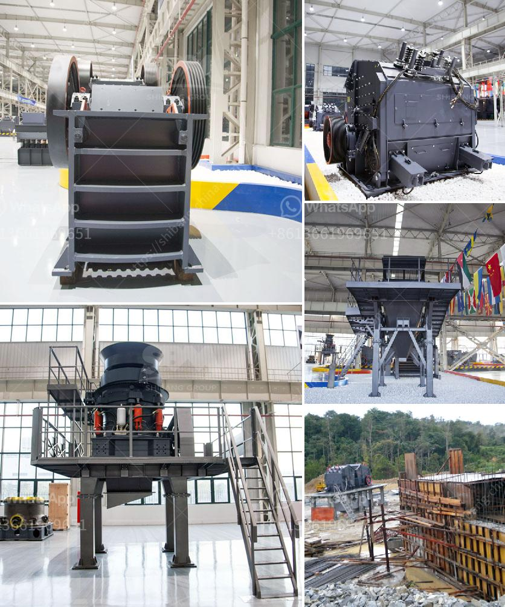

<h3>calculation of owning and operating costs of crushers</h3>
Crushing equipment is the heart of an industrial material-processing system. The size reduction choices you make will have a profound impact on the profitability of your business. When the right choice is made, you should expect many years of profitable operation. However, the wrong choice can cripple your productivity and stop your business from growing. One of the key factors that will determine the success of your crusher is the total cost of ownership and operating costs associated with its use.

The first step in the calculation of owning and operating costs is to determine the selection of equipment that will efficiently match the material requirements of a project. This study takes into consideration the mining or quarrying methods, material properties, time schedules and equipment design of a plant. The purpose of this article is to outline the factors to consider when calculating owning and operating costs and determining the best crusher for your business.

The main consideration in determining the optimum plant for any given mine or quarry operation is the underlying geology of the deposit. This will have a large impact on the choice of equipment and the layout of the plant. For instance, if the material is easily excavated, a mobile crusher can be used to process it. On the other hand, if the material is tough and abrasive, a stationary crusher may be preferred.

Once the equipment selection is made, the next step is to calculate the owning and operating costs. Generally, owning and operating costs can be divided into two, direct costs and indirect costs. Direct costs refer to costs that are directly attributed to the production of the material, such as labor, equipment maintenance, and fuel. Indirect costs refer to costs that are not directly related to the production, such as administrative expenses, insurance, and taxes.

To calculate the direct costs, it is important to consider factors such as the hourly production rate, the capacity of the crusher, and the number of hours of operation per day. The fuel consumption rate for a piece of equipment depends on the power required for the crushing operation as well as the efficiency of the machine design. The efficiency can be calculated by dividing the energy input to the crusher by the energy output of the crusher.

On the other hand, indirect costs can be calculated by considering the allocation of costs across various activities. These costs will vary depending on the size of the operation, the complexity of the material processing, and the regulatory environment. It is important to carefully track and allocate these costs to ensure an accurate calculation of ownership and operating costs.

In conclusion, calculating the owning and operating costs of a crusher is a crucial step in the decision-making process. Understanding the costs associated with the use of equipment will help you make the right choice, save money, and maximize your profitability. By considering factors such as material properties, geology, and production requirements, you can select the most suitable crusher for your business. Furthermore, accurately tracking and allocating direct and indirect costs will give you a clearer picture of the total cost of ownership and operating costs.
<h3>Contact us</h3><ul><li><strong>Whatsapp:&nbsp;<a href="https://wa.me/8613661969651">+8613661969651</a></strong></li><li><a href="https://swt.shibang-china.com/?git&amp;zhl&amp;calculation of owning and operating costs of crushers"><strong>Online Service(chat now)</strong></a></li></ul><h3>Related</h3><ul><li><a href='process of crushing stones.md'>process of crushing stones</a></li><li><a href='hot sale and low cost mobile crushing plant.md'>hot sale and low cost mobile crushing plant</a></li><li><a href='aggregate crusher supplier.md'>aggregate crusher supplier</a></li><li><a href='diagram of hammer mill machine.md'>diagram of hammer mill machine</a></li><li><a href='quartz manufacturing plant.md'>quartz manufacturing plant</a></li></ul>