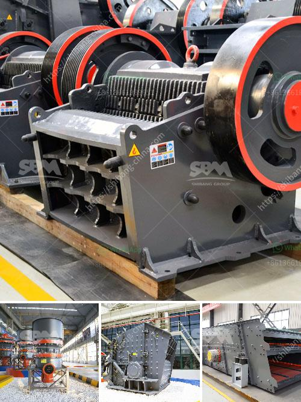

<h3>cannabis mechoire cannabis crusher in pakistan</h3>
Cannabis is a plant that has been used for centuries for various purposes including medicinal, recreational, and cultural. In recent years, there has been a growing interest in cannabis and its derivatives due to its potential health benefits. Pakistan is one such country where cannabis consumption is prevalent, and the demand for cannabis-related products is on the rise. One such product gaining popularity in Pakistan is the cannabis mechoire cannabis crusher.

The mechoire cannabis crusher is a device used to grind or crush cannabis buds into a finer consistency. This device is essential for individuals who consume cannabis either for recreational or medicinal purposes. It helps in breaking down the flowers, making it easier to roll joints, pack bowls, or use in vaporizers. The mechoire cannabis crusher is usually made of sturdy materials like metal or wood and consists of two parts that fit together.

In Pakistan, the use of cannabis is not legalized, but it is still widely consumed. Many people use cannabis for recreational purposes to experience a sense of relaxation and euphoria. However, there is also a significant portion of the population that utilizes cannabis for its potential medicinal benefits. Some of the medicinal uses of cannabis include relief from chronic pain, management of epilepsy, alleviation of anxiety and depression, and reduction of chemotherapy side effects.

The mechoire cannabis crusher in Pakistan has gained popularity due to its convenience and efficiency. Grinding or crushing the cannabis buds helps to release the active compounds present in the plant more effectively. When cannabis is broken down into smaller particles, it increases the surface area, facilitating better extraction of cannabinoids like tetrahydrocannabinol (THC) and cannabidiol (CBD). These cannabinoids are responsible for the psychoactive and therapeutic effects of cannabis.

Furthermore, the use of a mechoire cannabis crusher ensures that no part of the cannabis plant goes to waste. By grinding the buds, users can maximize the yield of their cannabis, making it cost-effective. Additionally, the consistency achieved through grinding or crushing ensures a smoother smoking experience by preventing uneven burns and improving airflow.

However, it is essential to note that the use of cannabis is not without risks. Excessive or chronic cannabis consumption can lead to adverse effects on mental health, memory problems, and addiction. Therefore, responsible use and moderation are crucial when consuming cannabis.

In conclusion, the mechoire cannabis crusher has emerged as a popular accessory among cannabis users in Pakistan. Its effectiveness in breaking down cannabis buds, convenience, and cost-effectiveness have contributed to its demand. It is essential for users to be well-informed about the potential risks and benefits associated with cannabis consumption and to consume responsibly.
<h3>Contact us</h3><ul><li><strong>Whatsapp:&nbsp;<a href="https://wa.me/8613661969651">+8613661969651</a></strong></li><li><a href="https://swt.shibang-china.com/?git&amp;zhl&amp;cannabis mechoire cannabis crusher in pakistan"><strong>Online Service(chat now)</strong></a></li></ul><h3>Related</h3><ul><li><a href='ball mill 800 ton day.md'>ball mill 800 ton day</a></li><li><a href='processing on barite crushing.md'>processing on barite crushing</a></li><li><a href='mobile stone crushing machine.md'>mobile stone crushing machine</a></li><li><a href='limestone tons hour machinery.md'>limestone tons hour machinery</a></li><li><a href='small jaw crusher.md'>small jaw crusher</a></li></ul>