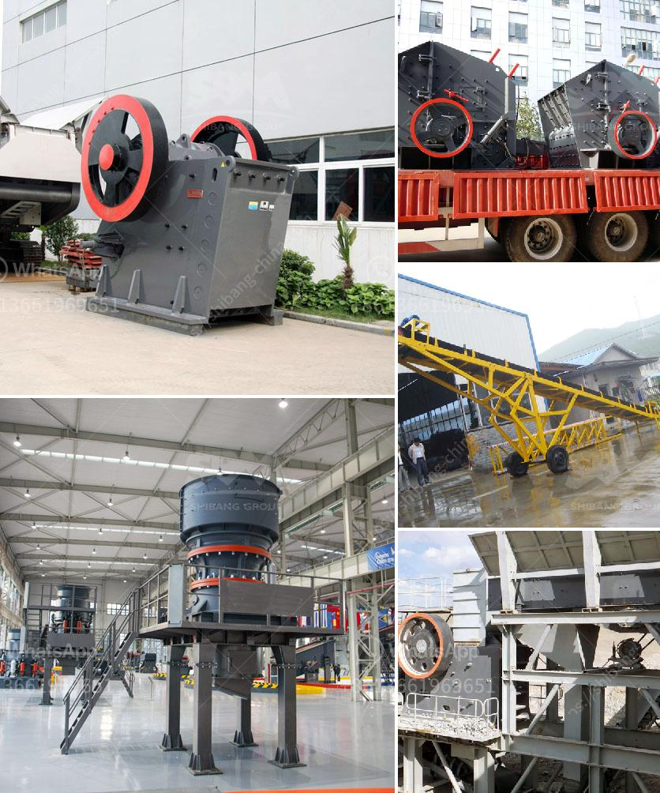

<h3>carbon black grinding machine</h3>
Carbon black is a material produced from the incomplete combustion of hydrocarbons, such as oil or gas. It is a fine black powder that has a range of uses in various industries. One of the most common applications of carbon black is as a pigment in paints, inks, and plastics. It is also used as a reinforcing filler in tires and other rubber products.

In order to process carbon black, manufacturers utilize specialized carbon black grinding machines. These machines are designed to grind carbon black into a fine powder that can be used in various applications. The machines provide an efficient and uniform grinding of carbon black and conductive carbon.

One of the key features of carbon black grinding machines is their energy efficiency. Unlike traditional grinding methods, these machines consume less energy and emit less carbon dioxide. This makes them an environmentally friendly option for grinding carbon black.

Another advantage of using carbon black grinding machines is their ability to produce uniform and high-quality carbon black powder. These machines use advanced technology to ensure that each particle is of the same size and shape. This is crucial for achieving the desired properties and performance in different applications.

Furthermore, carbon black grinding machines are designed to be durable and long-lasting. They are built with high-quality materials and components, ensuring their reliability and longevity. Regular maintenance and proper care can further extend the lifespan of these machines.

In conclusion, carbon black grinding machines are essential equipment for processing carbon black into a fine powder. They offer energy efficiency, produce uniform and high-quality carbon black powder, and are built to withstand long-term use. These machines play a crucial role in various industries, including paints, inks, plastics, and rubber production. By utilizing carbon black grinding machines, manufacturers can efficiently and effectively produce carbon black for their specific applications.
<h3>Contact us</h3><ul><li><strong>Whatsapp:&nbsp;<a href="https://wa.me/8613661969651">+8613661969651</a></strong></li><li><a href="https://swt.shibang-china.com/?git&amp;zhl&amp;carbon black grinding machine"><strong>Online Service(chat now)</strong></a></li></ul><h3>Related</h3><ul><li><a href='vibrating screens for material crusher.md'>vibrating screens for material crusher</a></li><li><a href='silica sand mining process equipment in south africa.md'>silica sand mining process equipment in south africa</a></li><li><a href='business proposal preparation for mobile crusher.md'>business proposal preparation for mobile crusher</a></li><li><a href='consol glass cullet price per ton south africa.md'>consol glass cullet price per ton south africa</a></li><li><a href='suppliers of ball mill in bhopal.md'>suppliers of ball mill in bhopal</a></li></ul>