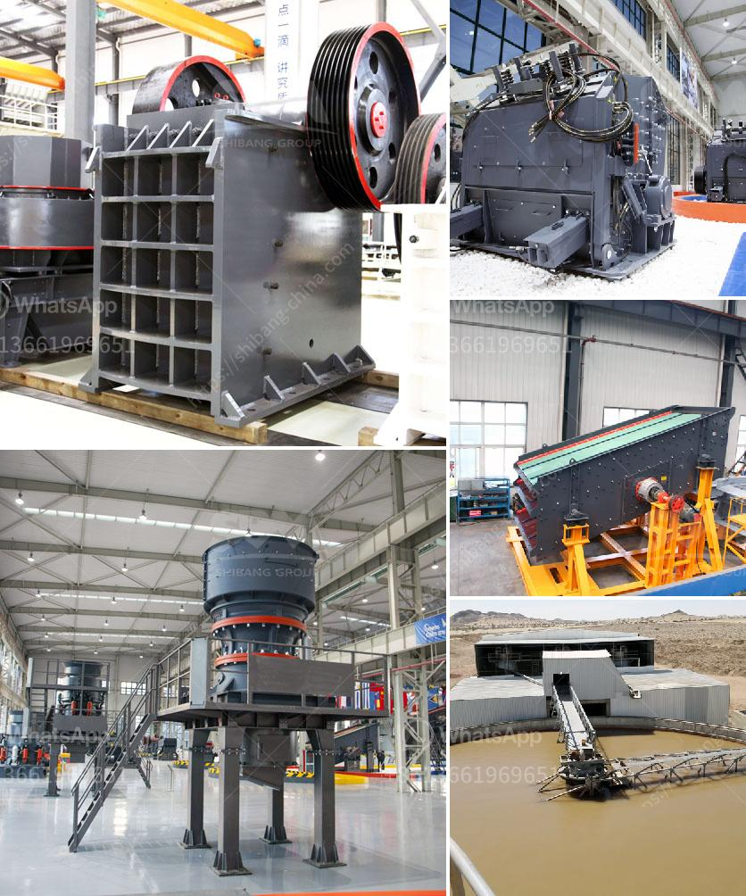

<h3>carbon black processing machine in delhi</h3>
Carbon black is an important industrial material that is widely used in various sectors such as rubber, plastic, ink, and paint manufacturing. It is produced by the incomplete combustion of hydrocarbon fuels, resulting in a fine black powder with unique properties. In recent years, the demand for carbon black has been steadily increasing due to its numerous applications. To meet this growing demand, carbon black processing machines have become crucial, especially in cities like Delhi.

Delhi, being the capital city of India, is a major hub for manufacturing industries. This includes rubber and plastic manufacturing units, which heavily rely on carbon black as a key ingredient. As a result, the need for high-quality carbon black processing machines in Delhi has been on the rise. These machines play a vital role in efficiently processing and refining carbon black powder, enhancing its quality and usability.

One of the primary purposes of carbon black processing machines is to ensure the removal of impurities from the raw carbon black powder. During the combustion process, various contaminants can mix with the carbon black, reducing its performance and quality. These contaminants include ash, sulfur, and volatile substances that can negatively impact the final product. A carbon black processing machine utilizes various techniques such as sieving, magnetic separation, and centrifugal separators to effectively remove these impurities, resulting in a purified and more valuable carbon black powder.

Another significant aspect of carbon black processing machines is their ability to customize the characteristics of carbon black powder. Different applications may require specific properties of carbon black, such as particle size, structure, and surface area. A carbon black processing machine allows for precise control over these parameters, ensuring the production of carbon black powder with desired qualities. This versatility is particularly important in industries such as ink and paint manufacturing, where different grades of carbon black are required for specific applications.

Apart from customization, carbon black processing machines also contribute to environmental sustainability. Carbon black production from traditional methods often involves the release of harmful gases and pollutants into the atmosphere. However, modern processing machines employ advanced technologies to minimize emissions and ensure eco-friendly manufacturing processes. Delhi, being notorious for its air pollution, can greatly benefit from the adoption of such machines, as they help in reducing the carbon footprint and promoting a cleaner environment.

Additionally, carbon black processing machines have the potential to boost the local economy in Delhi. By establishing manufacturing units for these machines, the region can witness job creation and technological advancements. Local entrepreneurs and investors can tap into this growing market and contribute to the development of carbon black processing industry in Delhi.

In conclusion, carbon black processing machines have emerged as essential equipment for industries relying on carbon black powder. With its ability to remove impurities, customize properties, and promote sustainable production, these machines have become indispensable in cities like Delhi. Their adoption not only improves the quality of carbon black but also contributes to environmental sustainability and local economic growth. As the demand for carbon black continues to surge, it is crucial for Delhi to invest in the development and promotion of carbon black processing machines.
<h3>Contact us</h3><ul><li><strong>Whatsapp:&nbsp;<a href="https://wa.me/8613661969651">+8613661969651</a></strong></li><li><a href="https://swt.shibang-china.com/?git&amp;zhl&amp;carbon black processing machine in delhi"><strong>Online Service(chat now)</strong></a></li></ul><h3>Related</h3><ul><li><a href='quartz stone powder machinery manufacturing companies.md'>quartz stone powder machinery manufacturing companies</a></li><li><a href='used raymond mill for sale in taiwan crusher.md'>used raymond mill for sale in taiwan crusher</a></li><li><a href='low productivity jaw crusher.md'>low productivity jaw crusher</a></li><li><a href='iron crusher in mexico.md'>iron crusher in mexico</a></li><li><a href='micro fine powder grinder.md'>micro fine powder grinder</a></li></ul>