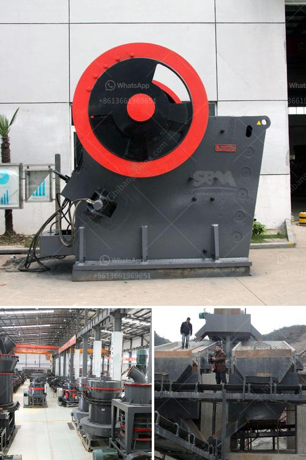

<h3>carbon black pulverizer</h3>
Carbon black is a commonly used substance in various industrial applications due to its versatile properties. It is primarily used as a reinforcing filler in rubber products, such as tires, conveyor belts, and seals, to improve their strength, durability, and resistance to abrasion. To achieve the desired particle size and uniformity, carbon black pulverizers are used.

A carbon black pulverizer is a machine used to reduce carbon black particles into smaller and finer sizes for various applications. It is an essential equipment in the carbon black processing industry, ensuring efficient and high-quality production. The pulverizer works by using a combination of impact and friction forces to grind the carbon black particles into the desired size range.

One of the key advantages of using a carbon black pulverizer is the control it provides over the particle size distribution. Different industries have specific requirements for the particle size of carbon black, and the pulverizer allows manufacturers to tailor the size distribution to meet those requirements. The precise control over particle size also enhances the properties of the final product, such as improved dispersion and reinforcement in rubber compounds.

Another benefit of using a carbon black pulverizer is its ability to increase production efficiency. By reducing the particle size, the pulverizer increases the surface area of carbon black particles, allowing for better dispersion in rubber compounds. This results in improved mechanical properties, such as increased tensile strength and abrasion resistance, in the final products. Additionally, the smaller particle size facilitates easier mixing, extrusion, and molding processes, saving time and energy during manufacturing.

Furthermore, using a carbon black pulverizer helps to ensure product consistency and quality. The pulverizer can consistently produce carbon black particles with the desired size and properties, reducing batch-to-batch variations. This is particularly crucial in industries that require strict adherence to specifications, such as tire manufacturing, where consistent performance is essential for safety and performance.

In recent years, with advancements in pulverizer technology, carbon black pulverizers have become more efficient, producing finer particles with improved dispersion and reinforcing properties. Advanced pulverizer designs often incorporate features such as adjustable grinding gap, air classification, and high-speed impact forces to achieve optimal pulverization results.

Moreover, modern carbon black pulverizers are designed with robust safety features to protect operators and prevent any accidents. These features include interlocks, enclosures, and emergency stop buttons, ensuring safe operation and maintenance.

In conclusion, carbon black pulverizers are vital machines in the carbon black processing industry. They play a crucial role in reducing the particle size of carbon black, allowing manufacturers to achieve the desired properties in their final products. The control over particle size distribution, increased production efficiency, and improved product consistency are some of the key advantages of using a carbon black pulverizer. With continuous advancements in pulverizer technology, these machines are becoming more efficient and safer, enabling manufacturers to meet the ever-increasing demands of various industries.
<h3>Contact us</h3><ul><li><strong>Whatsapp:&nbsp;<a href="https://wa.me/8613661969651">+8613661969651</a></strong></li><li><a href="https://swt.shibang-china.com/?git&amp;zhl&amp;carbon black pulverizer"><strong>Online Service(chat now)</strong></a></li></ul><h3>Related</h3><ul><li><a href='concrete breakers for sale in south africa.md'>concrete breakers for sale in south africa</a></li><li><a href='coal crusher machine manufacturer in india.md'>coal crusher machine manufacturer in india</a></li><li><a href='price of ball mill.md'>price of ball mill</a></li><li><a href='gypsum plant feasibility study.md'>gypsum plant feasibility study</a></li><li><a href='crusher plant in jizan saudi arabia.md'>crusher plant in jizan saudi arabia</a></li></ul>