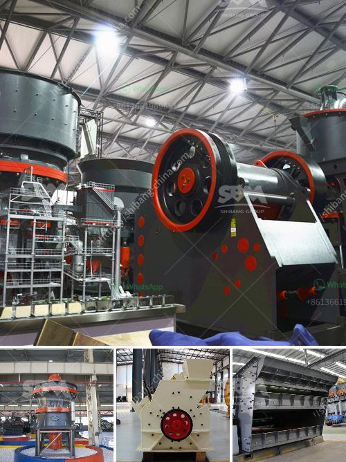

<h3>catalog of stone crusher production line made in iran</h3>
Iran has a rich history of stone quarrying and mining and is known for its high-quality stone products. With advancements in technology, Iran is now producing a wide range of stone materials for various construction applications. The stone crusher production line is indispensable for Iran's infrastructure development.

Stone crusher production line made in Iran consists of vibrating feeder, jaw crusher, impact crusher, vibrating screen, belt conveyor and centralized electronic control. These equipment are suitable for various materials such as limestone, granite, basalt, river pebble, etc.

The stone crusher production line has high automation, large crushing ratio, high production efficiency, and large processing capacity. The broken product has a cubic shape, low needle-like content, no internal cracks, and high compressive strength. The equipment has low energy consumption and is environmentally friendly. It can be used for various construction projects such as highway construction, bridge construction, and building construction.

1. Vibrating Feeder: The vibrating feeder provides a continuous and uniform feeding function. It has the advantages of simple structure, reliable operation, convenient adjustment, and installation. It can feed materials into the jaw crusher evenly and continuously.

2. Jaw Crusher: The jaw crusher is the core equipment in the stone crusher production line. It has the advantages of large crushing ratio, high production efficiency, and low energy consumption. It is widely used in mining, metallurgy, construction, highway, railway, water conservancy, and chemical industries.

3. Impact Crusher: The impact crusher uses impact energy to crush materials. It is suitable for medium and fine crushing operations. The impact crusher has the advantages of large crushing ratio, high production efficiency, and low energy consumption. It can process materials with a side length of 100-500mm and a compressive strength of up to 350MPa.

4. Vibrating Screen: The vibrating screen is used to screen the crushed materials. It has a large processing capacity and high screening efficiency. The vibrating screen can be adjusted to control the particle size of the finished product.

5. Belt Conveyor: The belt conveyor is responsible for the transportation of materials. It has the advantages of long conveying distance, large conveying capacity, and low energy consumption. It is an essential equipment in the stone crusher production line.

In conclusion, the stone crusher production line made in Iran has a wide application range and provides comprehensive technical support for Iran's infrastructure construction. With its high-quality products and advanced technology, Iran's stone crusher production line is gaining recognition in the international market. It is expected to contribute significantly to the development of Iran's construction industry.
<h3>Contact us</h3><ul><li><strong>Whatsapp:&nbsp;<a href="https://wa.me/8613661969651">+8613661969651</a></strong></li><li><a href="https://swt.shibang-china.com/?git&amp;zhl&amp;catalog of stone crusher production line made in iran"><strong>Online Service(chat now)</strong></a></li></ul><h3>Related</h3><ul><li><a href='gold refinery in philippines south africa.md'>gold refinery in philippines south africa</a></li><li><a href='ball mill machine for powder.md'>ball mill machine for powder</a></li><li><a href='stone crusher machine price in ethiopia.md'>stone crusher machine price in ethiopia</a></li><li><a href='ultrafine ball mills machine.md'>ultrafine ball mills machine</a></li><li><a href='how much complete cost for iron ore crasher plants setup.md'>how much complete cost for iron ore crasher plants setup</a></li></ul>