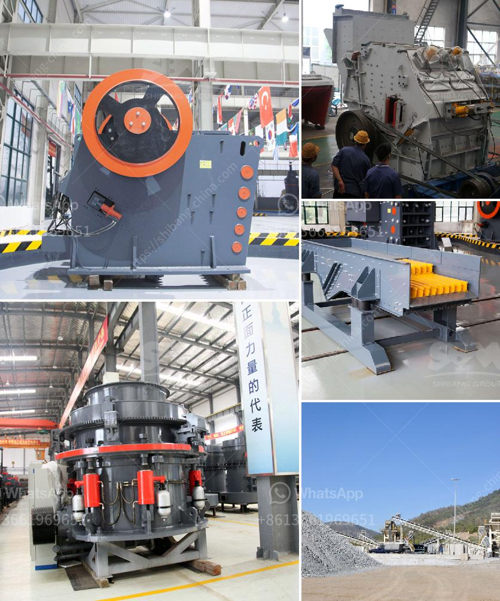

<h3>cement cement grinding ball mill</h3>
Cement grinding ball mills are widely used in cement production lines and are used for grinding cement clinker into powder to make cement. Cement clinker is often mixed with a small amount of gypsum to ensure optimal setting time. The cement ball mill grinds cement clinker, gypsum, and other materials to a typical product fineness of 300-5000 cm²/g.

Cement ball mills are usually equipped with a built-in classifier, which separates the ground particles into fine and coarse fractions. The coarse fraction is sent back to the mill for further grinding, while the fine fraction is collected in bags or bins for use as cement product.

The efficiency of cement grinding ball mills is determined by several factors, such as mill design, size, and speed, liner design and material, grinding media size and type, and overall mill volume and load. Increasing the mill speed or filling up to a certain level can improve grinding efficiency, but beyond a certain point, it may lead to excessive wear and reduced mill lifespan.

The grinding media in cement ball mills include steel balls, ceramic balls, and cylpebs. Sizes and qualities of the grinding media vary depending on the fineness and hardness of the cement clinker. Ideally, the grinding media should be high in hardness, have high wear resistance, and be robust enough to crush the clinker particles efficiently.

Regular maintenance of cement grinding ball mills is crucial to ensure optimal performance and prolong their lifespan. This includes regular inspection of the mill internals, lubrication system, and grinding media, as well as replacing or repairing any damaged or worn parts.

In conclusion, cement grinding ball mills play a crucial role in cement production lines by grinding cement clinker into powder and optimizing its setting time. The efficiency of these mills depends on various factors, including mill design, grinding media type, and maintenance. By selecting the appropriate grinding media and regularly maintaining the mill, operators can ensure reliable and efficient cement production.
<h3>Contact us</h3><ul><li><strong>Whatsapp:&nbsp;<a href="https://wa.me/8613661969651">+8613661969651</a></strong></li><li><a href="https://swt.shibang-china.com/?git&amp;zhl&amp;cement cement grinding ball mill"><strong>Online Service(chat now)</strong></a></li></ul><h3>Related</h3><ul><li><a href='cone crusher for sale in india.md'>cone crusher for sale in india</a></li><li><a href='gold processing machinery in china.md'>gold processing machinery in china</a></li><li><a href='used 900 cone crusher for sale.md'>used 900 cone crusher for sale</a></li><li><a href='feasibility report on block making industry in nigeria.md'>feasibility report on block making industry in nigeria</a></li><li><a href='vibrating screens pictures.md'>vibrating screens pictures</a></li></ul>