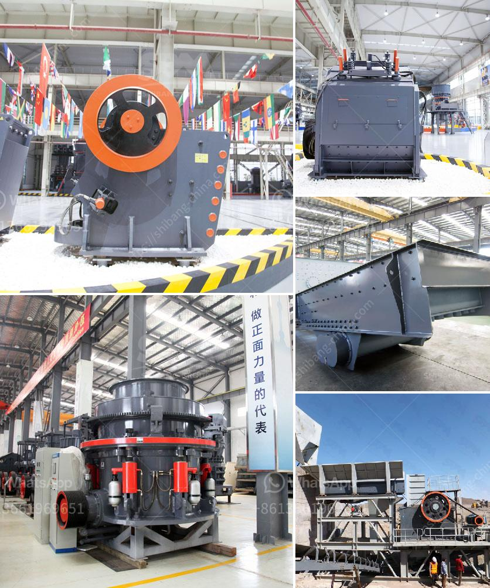

<h3>cement clinker ball mill</h3>
Cement clinker ball mill is a type of high-efficiency and energy-saving grinding equipment, widely used in the cement manufacturing industry. It is mainly used for grinding the clinker and raw materials in cement plant, and also can be applied in metallurgy, chemical, electric power and other industries to grind all kinds of ores.

Cement clinker ball mill is not only suitable for over-flow grinding, but also applicable for cyclic close-flow grinding together with powder collector. The cement clinker ball mill has a simple structure, low investment and easy operation and maintenance.

The grinding media are generally balls, which are made of steel or other materials with high hardness. The grinding process is performed in a closed system, ensuring that there is no dust leakage during the operation. The cement clinker ball mill has a small footprint, making it an ideal choice for small and medium-sized cement plants.

With the latest technology, the cement clinker ball mill is equipped with a separator, which separates the fine powder from the coarse powder and returns the coarse powder to the mill inlet for re-grinding. This saves energy and reduces the production cost.

As a professional manufacturer of cement clinker ball mill, Fote Machinery has made continuous efforts in the research and development of grinding equipment. The cement clinker ball mill produced by our company can adopt different types of lining plates according to the production requirements, such as high-manganese steel lining plates, hyperboloid lining plates, layered lining plates, etc.

These lining plates are easy to replace and convenient to maintain. The steel balls used in the cement clinker ball mill are small in size, allowing for easy and quick movement through the grinding chamber.

In addition, the cement clinker ball mill is also suitable for the grinding of slag, limestone, ceramic and other materials. The discharge size of the finished product can be adjusted between 0.074-0.89mm for different needs. The cement clinker ball mill has strong adaptability to materials and continuous production.

It is widely used in many industries, including cement, silicate products, new building materials, refractory materials, fertilizers, black and non-ferrous metal dressings, and glass ceramics production.

Overall, the cement clinker ball mill is a reliable choice for grinding cement clinker, gypsum, and similar materials of moderate moisture content. Its unique design allows for easy maintenance and high efficiency. With the continuous efforts in research and development, Fote Machinery has produced high-quality cement clinker ball mills for a wide range of applications.
<h3>Contact us</h3><ul><li><strong>Whatsapp:&nbsp;<a href="https://wa.me/8613661969651">+8613661969651</a></strong></li><li><a href="https://swt.shibang-china.com/?git&amp;zhl&amp;cement clinker ball mill"><strong>Online Service(chat now)</strong></a></li></ul><h3>Related</h3><ul><li><a href='jaw crusser indonesia.md'>jaw crusser indonesia</a></li><li><a href='for sale stone crusher in sri lanka.md'>for sale stone crusher in sri lanka</a></li><li><a href='hammer mill machine 20hp.md'>hammer mill machine 20hp</a></li><li><a href='quarry plant all in one gold mining equipment.md'>quarry plant all in one gold mining equipment</a></li><li><a href='american cone crushers.md'>american cone crushers</a></li></ul>