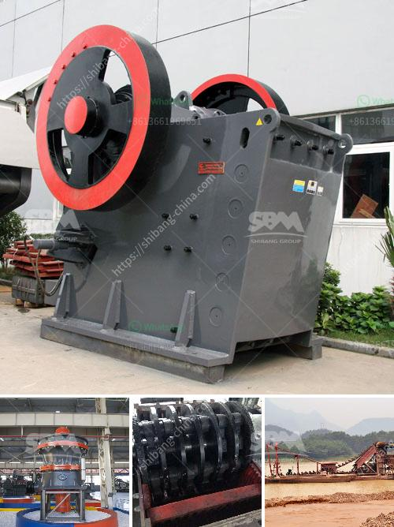

<h3>cement clinker grinding ball mill manufacturer india</h3>
Cement clinker grinding ball mill, also known as cement clinker ball mill, is a kind of equipment used to grind hard, nodular clinker from its cement kiln into a fine powder. It is widely used in cement, silicate products, new building materials, refractory materials, fertilizers, black and non-ferrous metal beneficiation, glass, ceramics, and other production industries. It is suitable for dry or wet grinding of various ores and other materials.

In India, cement clinker grinding ball mill is a kind of high efficient, energy-saving, and environment-friendly grinding equipment. It not only improves cement performance and reduces energy consumption but also has significant economic benefits.

Cement clinker grinding ball mill manufacturer India is a professional manufacturer of cement clinker grinding ball mill, which has more than 30 years of experience in the development and production of cement grinding equipment. It has advanced manufacturing technology and rich experience and has independent research and development patents and national invention patents, ensuring the leading position of its products in the market.

The cement clinker grinding ball mill produced by this manufacturer has low price, good quality and guaranteed after-sales service. Fote Machinery (FTM) is one of the well-known cement grinding manufacturers supplying cement grinding machine to global customers for years. With advanced technology and rich experience, Fote Machinery has exported its products to more than 100 countries including India, Kenya, Tanzania, Nigeria, Pakistan, Bangladesh, the Philippines, and other countries.

India is a country with abundant resources and materials, and the cement processing industry has been gradually accelerating in recent years. The Indian cement industry is dominated by a few companies, and from some of the largest and oldest manufacturing units to small and medium enterprises (SMEs), there is a wide range of players in the industry. Therefore, the demand for cement grinding equipment is constantly increasing, and there is a huge market potential.

In conclusion, cement clinker grinding ball mill manufacturer India is committed to developing cement grinding and crushing equipment, technology, and manufacturing capabilities, and has been supply chain partners for numerous major cement companies in domestic markets and overseas markets.
<h3>Contact us</h3><ul><li><strong>Whatsapp:&nbsp;<a href="https://wa.me/8613661969651">+8613661969651</a></strong></li><li><a href="https://swt.shibang-china.com/?git&amp;zhl&amp;cement clinker grinding ball mill manufacturer india"><strong>Online Service(chat now)</strong></a></li></ul><h3>Related</h3><ul><li><a href='pfw impact crusher.md'>pfw impact crusher</a></li><li><a href='stone crusher plant layout.md'>stone crusher plant layout</a></li><li><a href='transmission for ball mill.md'>transmission for ball mill</a></li><li><a href='mobile crushing plant price.md'>mobile crushing plant price</a></li><li><a href='cement clinker grinding ball mill manufacturer india.md'>cement clinker grinding ball mill manufacturer india</a></li></ul>