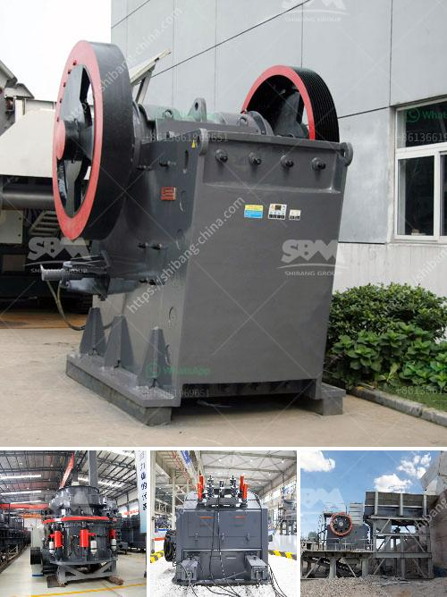

<h3>cement grinding machine</h3>
Cement grinding machines are essential equipment in cement production lines and are mainly used for grinding cement clinker and other materials in cement plants. The grinding process is the final manufacturing stage at a cement plant. After this process, the clinker will become fine cement powders and be transported to the cement silos for storage. 

Cement grinding machines can vary in size and configuration depending on the desired throughput and fineness of the cement particles. Traditionally, grinding machines have consisted of a rotating drum with steel balls inside that grind the clinker into fine powders. In recent years, advancements in technology have enabled the development of high-efficiency grinding machines that can enhance cement production capacity and output.

One popular type of cement grinding machine is a roller press. This machine works by material being fed between two counter-rotating rolls and pressed into a fine powder. The material is then pre-ground using smaller rollers before being fed into the final grinding chamber, where it is ground to the desired fineness. Roller presses are capable of producing cement with a narrower particle size distribution and a higher grinding efficiency compared to traditional ball mills.

Another type of cement grinding machine is a vertical roller mill. This mill uses a rotating disc to grind the feed material and uses centrifugal force to separate the ground material from the incoming feed. Vertical roller mills can be used for grinding various types of cement clinker, coal, and minerals in a cost-effective and energy-efficient manner.

Cement grinding machines are also equipped with a bag filter system to prevent fine dust from escaping into the atmosphere. These systems help to reduce environmental pollution and comply with emission regulations. Furthermore, cement grinding machines are equipped with noise-reducing measures to minimize noise pollution in the working environment.

The benefits of using cement grinding machines extend beyond the efficient grinding of cement clinker. The use of high-efficiency grinding machines can help cement producers reduce energy consumption and greenhouse gas emissions. By reducing the particle size of the clinker, the surface area is increased, which improves the reactivity of the cement. This can lead to stronger and more durable concrete structures.

In conclusion, cement grinding machines play a crucial role in cement production lines. They help to improve the efficiency of cement manufacturing and contribute to reducing environmental pollution. The advancements in technology have led to the development of high-efficiency grinding machines that offer better performance and enhance the quality of cement products. As the demand for sustainable construction materials grows, the use of cement grinding machines will continue to increase to meet the industry's needs.
<h3>Contact us</h3><ul><li><strong>Whatsapp:&nbsp;<a href="https://wa.me/8613661969651">+8613661969651</a></strong></li><li><a href="https://swt.shibang-china.com/?git&amp;zhl&amp;cement grinding machine"><strong>Online Service(chat now)</strong></a></li></ul><h3>Related</h3><ul><li><a href='marble paving making machinry price.md'>marble paving making machinry price</a></li><li><a href='rock crusher plant operations manager.md'>rock crusher plant operations manager</a></li><li><a href='used basalt stone jaw crusher for sale.md'>used basalt stone jaw crusher for sale</a></li><li><a href='calculation of owning and operating costs of crushers.md'>calculation of owning and operating costs of crushers</a></li><li><a href='buy ball mill india.md'>buy ball mill india</a></li></ul>