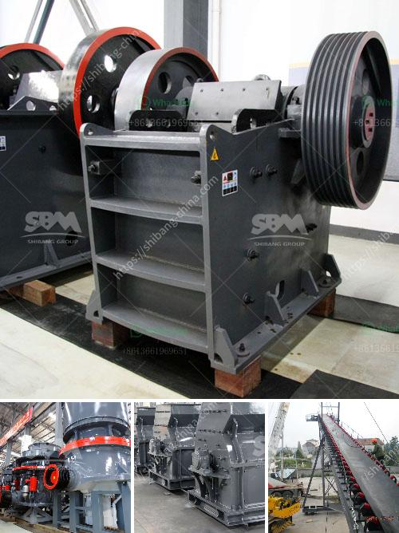

<h3>cement grinding plants</h3>
Cement grinding plants play a vital role in the cement manufacturing process, contributing to the sustainability and efficiency of the industry. These plants grind the clinker obtained from rotary kilns into a uniform powder that can be used as a binder in cement products.

The grinding process is a crucial step in cement production, as it is responsible for generating the final, fine particles necessary for high-quality cement. Grinding systems can be either 'open circuit' or 'closed circuit.' In an open circuit system, the materials are passed through the grinding mill once, while in a closed circuit system, the materials are recycled and fed back into the mill for further grinding.

The key equipment used in cement grinding plants is a ball mill. The horizontal rotating cylinder is partially filled with large steel balls, which grind the clinker to a fine powder. The clinker grinding process is highly energy-intensive, requiring substantial amounts of electricity. However, modern grinding processes have implemented energy-saving technologies to reduce power consumption.

One such technology is the use of vertical roller mills (VRMs), which have gained popularity in recent years due to their lower energy consumption and higher efficiency. VRMs utilize a combination of compressive force and shear to grind the clinker, resulting in a narrower particle size distribution compared to ball mills. This improved particle size distribution enhances the cement's performance and strength.

Another energy-saving technology is the use of high-pressure grinding rolls (HPGRs). HPGRs are used in the cement industry to reduce the energy consumption of the final grinding stage. These machines utilize a combination of high pressure and shear force to break down the clinker. HPGRs result in a more efficient and uniform grinding process, reducing the overall energy consumption of the plant.

In addition to energy-saving technologies, cement grinding plants also implement environmental measures to reduce emissions and environmental impact. Dust collectors are used to capture and filter the dust generated during the grinding process, preventing it from escaping into the atmosphere. Bag filters and electrostatic precipitators are common dust collection systems used in cement grinding plants.

Moreover, water is used during the grinding process to control the temperature inside the mill and reduce dust emissions. Water spray systems are installed in the mills to cool down the clinker and suppress dust formation. These measures contribute to the reduction of air pollution and ensure compliance with environmental regulations.

Overall, cement grinding plants are critical facilities in the cement industry, responsible for producing high-quality cement. Through the use of advanced technologies and environmental measures, these plants are able to optimize the grinding process, reduce energy consumption, and minimize environmental impact. As the demand for sustainable and efficient cement production increases, cement grinding plants will continue to play a significant role in the industry's transformation.
<h3>Contact us</h3><ul><li><strong>Whatsapp:&nbsp;<a href="https://wa.me/8613661969651">+8613661969651</a></strong></li><li><a href="https://swt.shibang-china.com/?git&amp;zhl&amp;cement grinding plants"><strong>Online Service(chat now)</strong></a></li></ul><h3>Related</h3><ul><li><a href='100tph wet grinding mill.md'>100tph wet grinding mill</a></li><li><a href='the roller grinding mill.md'>the roller grinding mill</a></li><li><a href='ball mill machine products from china.md'>ball mill machine products from china</a></li><li><a href='quarry machines for sale.md'>quarry machines for sale</a></li><li><a href='rock crushers in south africa.md'>rock crushers in south africa</a></li></ul>