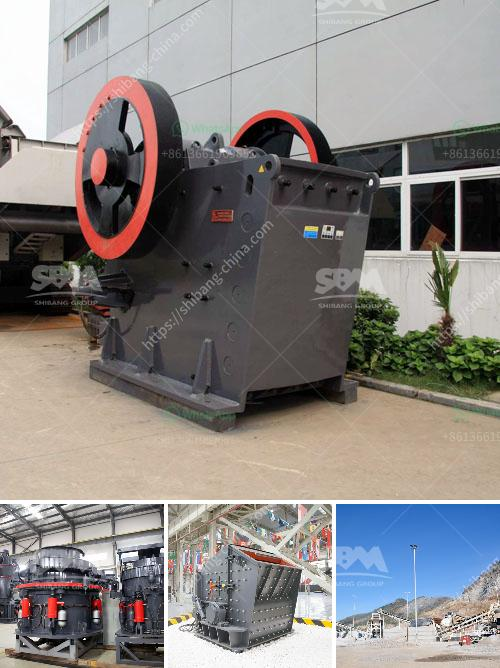

<h3>cement machinery manufacturers in europe</h3>
Europe has always been at the forefront of innovation and technological advancement. When it comes to the construction industry, European cement machinery manufacturers are leading the way with their cutting-edge equipment and machinery. These manufacturers are revolutionizing the cement production process, making it more efficient, sustainable, and cost-effective.

The construction industry heavily relies on cement as a key building material, and as the demand for construction projects increases, so does the need for efficient cement machinery. European manufacturers understand this demand and have consistently developed state-of-the-art machinery to meet the industry's evolving needs.

One of the key reasons why European cement machinery manufacturers excel is their emphasis on innovation. They continuously invest in research and development to improve the quality and efficiency of their machinery. These manufacturers aim to develop equipment that not only meets the current industry standards but also addresses the growing concerns for environmental sustainability.

Moreover, European manufacturers prioritize the use of advanced technologies and automation in their machinery. This not only increases the production capacity but also reduces manual labor and enhances the overall safety of the workers. With automated machinery, the precision and accuracy of the cement production process are significantly improved, leading to higher quality and consistent products.

In addition to innovation and automation, European cement machinery manufacturers also focus on sustainability. They strive to reduce the environmental impact by developing machinery that is energy-efficient and minimizes waste production. Many of them also integrate advanced filtration and dust collection systems into their equipment to control air pollution during the cement manufacturing process.

Furthermore, European manufacturers ensure that their machinery meets the highest safety standards. This includes implementing advanced safety features, providing rigorous training to operators, and conducting regular maintenance checks. By prioritizing safety, these manufacturers ensure the well-being of the workers and prevent any potential accidents or mishaps.

Overall, European cement machinery manufacturers are driving the transformation of the construction industry by providing efficient, innovative, and sustainable solutions. Their commitment to continuous improvement and focus on meeting the industry's evolving needs position them as global leaders in cement machinery manufacturing. As the demand for cement continues to rise, European manufacturers will continue to play a crucial role in shaping the future of the construction industry.
<h3>Contact us</h3><ul><li><strong>Whatsapp:&nbsp;<a href="https://wa.me/8613661969651">+8613661969651</a></strong></li><li><a href="https://swt.shibang-china.com/?git&amp;zhl&amp;cement machinery manufacturers in europe"><strong>Online Service(chat now)</strong></a></li></ul><h3>Related</h3><ul><li><a href='stone crusher for quarry.md'>stone crusher for quarry</a></li><li><a href='gypsum board powder plant in ethiopia.md'>gypsum board powder plant in ethiopia</a></li><li><a href='calcite ball milling equipment.md'>calcite ball milling equipment</a></li><li><a href='calcium carbonate manufacturing machine.md'>calcium carbonate manufacturing machine</a></li><li><a href='gravel stone crusher plant.md'>gravel stone crusher plant</a></li></ul>