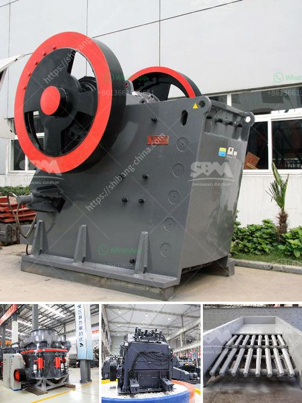

<h3>cement making machinery for whole cement plant</h3>
Cement production is a crucial process that requires extensive machinery and equipment. The cement plant machinery is responsible for ensuring that the cement production process runs smoothly and efficiently. From crushing and grinding of raw materials, to heating and calcination of the materials, to clinker production, and finally cement grinding and packaging, each step of the cement manufacturing process requires specific machinery.

One of the essential machinery in the cement plant is the crusher, which is responsible for crushing the raw material into smaller pieces. The crusher can be either a jaw crusher for coarse crushing or a hammer crusher for medium to fine crushing. After the raw materials have been crushed, they are then fed into the raw mill for further grinding.

The raw mill is another critical machinery in the cement plant, responsible for grinding the raw materials into a fine powder. The raw mill consists of two chambers, a drying chamber and a grinding chamber. In the grinding chamber, the raw materials are ground to a fine powder, which is called raw meal. This raw meal is then transferred to the kiln for further processing.

The kiln is the heart of the cement plant, where the raw meal undergoes a series of chemical reactions at high temperatures to form clinker. There are various types of kilns used in the cement industry, including rotary kilns, shaft kilns, and preheater kilns. The type of kiln used depends on the specific requirements of the cement plant and the desired clinker quality.

Once the clinker is produced, it is then cooled and ground into a fine powder in the cement mill. The cement mill is responsible for grinding the clinker, gypsum, and other additives into the final product – cement. The cement mill can be either a ball mill or a vertical roller mill, depending on the desired fineness of the cement and the composition of the raw materials.

Apart from these primary machinery, other auxiliary equipment is also required in a cement plant. These include conveyors, bucket elevators, dust collectors, and silos for storing raw materials and finished products. The conveyors and bucket elevators are responsible for transporting the raw materials and finished products between different stages of the cement production process. The dust collectors are essential for keeping the plant environment clean by capturing and filtering out dust generated during the production process. The silos are used for storing raw materials such as limestone, clay, and gypsum, as well as the finished cement product.

In conclusion, the cement plant machinery plays a vital role in the cement manufacturing process. From crushing and grinding of raw materials to clinker production and cement grinding, each stage relies on specific machinery for efficient and effective operation. Investing in high-quality cement plant machinery is crucial for ensuring a smooth and productive cement production process.
<h3>Contact us</h3><ul><li><strong>Whatsapp:&nbsp;<a href="https://wa.me/8613661969651">+8613661969651</a></strong></li><li><a href="https://swt.shibang-china.com/?git&amp;zhl&amp;cement making machinery for whole cement plant"><strong>Online Service(chat now)</strong></a></li></ul><h3>Related</h3><ul><li><a href='stone crushers in bennta in bogota.md'>stone crushers in bennta in bogota</a></li><li><a href='graphite mine slurry ball mill.md'>graphite mine slurry ball mill</a></li><li><a href='donesia lowongan kerja kuwait cement plant.md'>donesia lowongan kerja kuwait cement plant</a></li><li><a href='diamond dms plant for sale south africa.md'>diamond dms plant for sale south africa</a></li><li><a href='japan crushing machine manufacturers list.md'>japan crushing machine manufacturers list</a></li></ul>