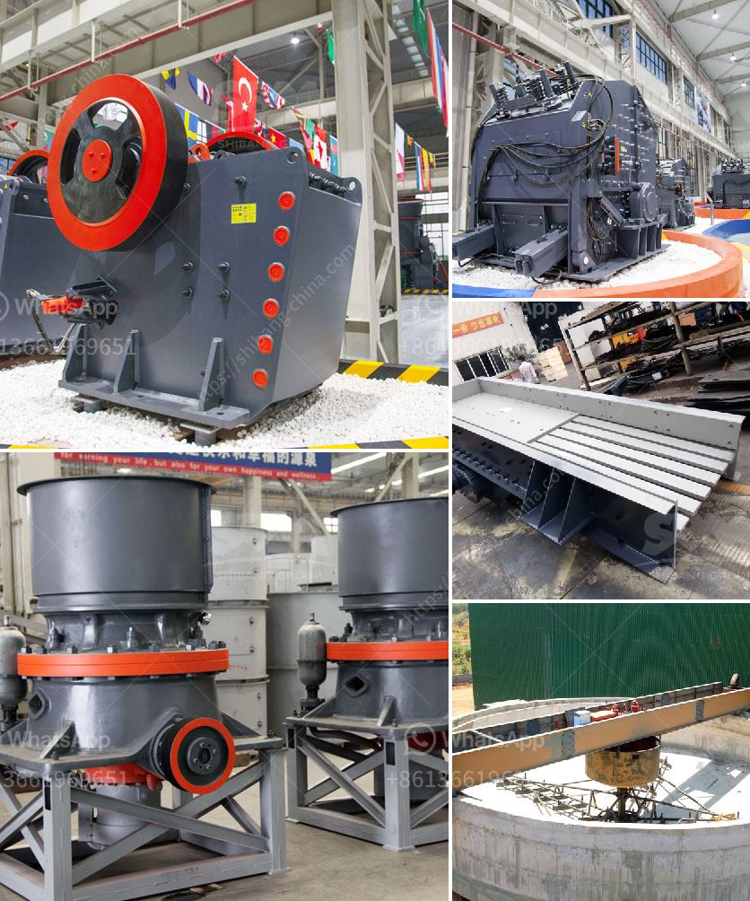

<h3>cement manufacturing equipment pdf</h3>
Cement manufacturing is a complex process that involves several stages and requires different types of equipment. It is important to understand the machinery used during the cement manufacturing process to ensure quality output and cost-effective production. One crucial tool during cement manufacturing is the cement manufacturing equipment PDF, which provides detailed information about the machinery used in the industry.

The cement manufacturing equipment PDF is a comprehensive guide on the machinery used in the cement manufacturing process. It highlights the importance of each equipment, describes their functions and benefits, and provides relevant technical specifications. This guide is essential for plant managers, engineers, technicians, and anyone involved in the cement manufacturing industry.

One of the main pieces of equipment mentioned in the cement manufacturing equipment PDF is the rotary kiln. The rotary kiln is a large cylindrical furnace that rotates to heat raw materials such as limestone, clay, and shale at a temperature of around 1400°C, effectively changing them into clinker. This equipment is crucial in the cement manufacturing process as it determines the quality of the final product. The guide provides in-depth information about the various types, designs, and maintenance requirements of rotary kilns.

Another important piece of machinery explained in the cement manufacturing equipment PDF is the cement mill. The cement mill is responsible for grinding clinker into cement, using specialized steel balls that crush and grind the clinker. It is a vital component of the cement manufacturing process and is often regarded as the heart of a cement plant. The PDF guide presents different types of cement mills, their features, and the overall grinding process involved.

Other equipment mentioned in the cement manufacturing equipment PDF includes crushers, conveyors, dust collectors, and storage silos. Crushers are used to break down large limestone rocks into smaller pieces, while conveyors transport materials between different stages of production. Dust collectors are crucial to control and minimize the emission of dust and other particles in the manufacturing plant. Storage silos, on the other hand, are used to store the final product before it is dispatched for distribution.

The cement manufacturing equipment PDF also highlights the importance of safety measures and quality control systems. Safety is a significant concern in the cement manufacturing process due to hazardous conditions and heavy machinery involved. The guide emphasizes the need for proper training, equipment maintenance, and ensuring compliance with safety regulations to protect the workers.

Quality control is another critical aspect of cement manufacturing. The PDF guide provides insights into the quality control systems used in the industry, including laboratory testing, process control techniques, and monitoring to ensure that the final product meets the required standards.

In conclusion, the cement manufacturing equipment PDF is a valuable resource for anyone involved or interested in the cement manufacturing industry. It provides comprehensive information about the machinery and equipment used in the process, along with their functions, benefits, and technical specifications. This guide is essential for plant managers, engineers, technicians, and workers as it helps them understand the different equipment's role in producing high-quality cement while maintaining safety and efficiency in the manufacturing plant.
<h3>Contact us</h3><ul><li><strong>Whatsapp:&nbsp;<a href="https://wa.me/8613661969651">+8613661969651</a></strong></li><li><a href="https://swt.shibang-china.com/?git&amp;zhl&amp;cement manufacturing equipment pdf"><strong>Online Service(chat now)</strong></a></li></ul><h3>Related</h3><ul><li><a href='difference between ball mill and roller mill.md'>difference between ball mill and roller mill</a></li><li><a href='granite rock crusher.md'>granite rock crusher</a></li><li><a href='quartz crusher machine.md'>quartz crusher machine</a></li><li><a href='hammer mill for sale philippines.md'>hammer mill for sale philippines</a></li><li><a href='granite quarrying and processing firm in kaduna.md'>granite quarrying and processing firm in kaduna</a></li></ul>