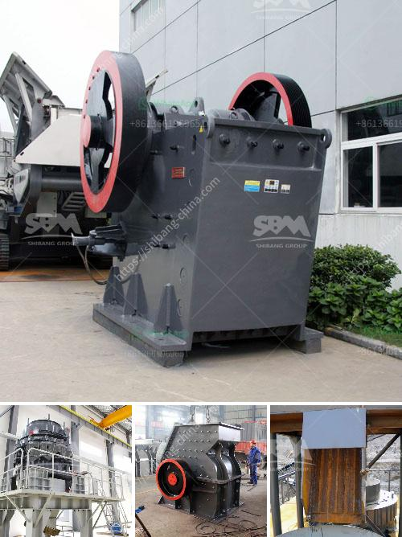

<h3>cement mill vertical price in india</h3>
Cement is an essential building material used for various construction projects in India. The demand for cement in the country has been steadily increasing due to rapid urbanization and infrastructure development. Cement mills are crucial in the manufacturing process of cement as they help grind the raw materials into a fine powder that is later used to produce the final product.

The price of vertical cement mills in India can vary significantly based on factors such as the capacity, power consumption, and quality of the equipment. The price range starts from a minimum of around INR 2,00,000 and can go up to INR 10,00,000 or more. The cost varies depending on the production capacity and features of the mill.

Vertical cement mills have gained popularity in recent years due to their efficiency and smaller footprint compared to traditional ball mills. These mills are equipped with a vertical roller system that helps reduce energy consumption and improve grinding efficiency. Additionally, vertical mills have the ability to dry, grind, and separate the raw materials all in one unit, making them highly efficient for cement production.

Several reputed manufacturers in India offer a range of vertical cement mills, providing customers with options to choose from based on their specific requirements and budget. It is important to consider factors such as power consumption, maintenance requirements, and after-sales service when selecting a mill.

As the demand for cement continues to rise in India, the price of vertical cement mills becomes a critical factor in the decision-making process for construction companies and cement manufacturers. Therefore, it is essential to research and compare prices from different suppliers to ensure the best value for money.

In conclusion, the price of vertical cement mills in India can vary based on several factors such as the capacity and features of the equipment. As construction activities continue to grow in the country, investing in efficient and cost-effective cement mills becomes crucial for manufacturers and construction companies to meet the rising demand for cement.
<h3>Contact us</h3><ul><li><strong>Whatsapp:&nbsp;<a href="https://wa.me/8613661969651">+8613661969651</a></strong></li><li><a href="https://swt.shibang-china.com/?git&amp;zhl&amp;cement mill vertical price in india"><strong>Online Service(chat now)</strong></a></li></ul><h3>Related</h3><ul><li><a href='cost of a hammer mill.md'>cost of a hammer mill</a></li><li><a href='cornerstone equipment used rock crushers.md'>cornerstone equipment used rock crushers</a></li><li><a href='marble crusher for sale.md'>marble crusher for sale</a></li><li><a href='crusher price sayaji.md'>crusher price sayaji</a></li><li><a href='200tph vsi crushers.md'>200tph vsi crushers</a></li></ul>