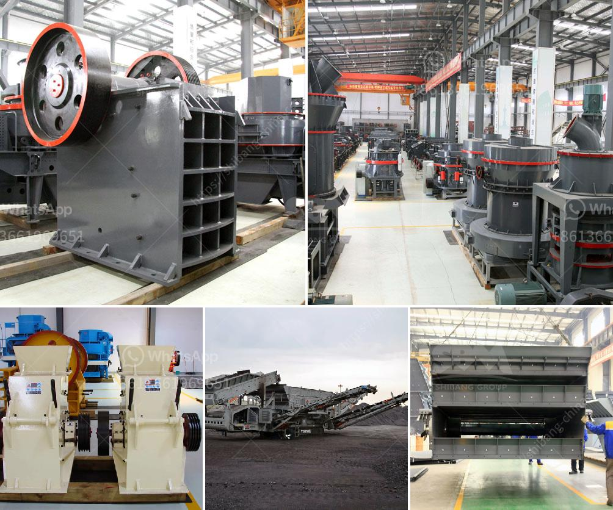

<h3>cement plant for sale intpd</h3>
Are you a construction company or an entrepreneur looking to expand your business in the cement industry? Well, here is an exciting opportunity for you! A cement plant with an impressive capacity of [insert capacity here]TPD is up for sale, and this could be the golden ticket to take your business to new heights.

Cement plants play a crucial role in the construction industry as they produce the primary material required for building structures. With the growing demand for infrastructure development globally, owning a cement plant can offer immense opportunities for financial growth and success. Let's explore why this cement plant for sale can be a profitable investment for you.

First and foremost, the capacity of [insert capacity here]TPD cement plant is substantial and allows for significant production. This means you can cater to a large volume of customers, contractors, and builders, attracting a diverse range of projects and clients. Increased production capacity translates into increased revenue potential.

Furthermore, the cement plant is equipped with state-of-the-art machinery and technology. Investing in a plant with modern equipment ensures efficient and cost-effective production. Advanced machinery helps in minimizing operational costs, improving productivity, and maintaining product quality. It also reduces the risk of breakdowns and enhances overall plant reliability.

In addition to the existing machinery, the cement plant comes with a trained workforce. A skilled and experienced team already familiar with the plant's operations can seamlessly integrate into your business. This saves you time and resources that would otherwise be spent in training new employees. With a ready-made team, you can hit the ground running and start producing cement immediately.

Moreover, owning a cement plant allows you to have better control over the supply chain. You are no longer reliant on external suppliers for your cement needs, which means you have greater flexibility and autonomy. This eliminates the risk of raw material shortages or unexpected price hikes that could disrupt project timelines and inflate costs.

Investing in a cement plant also gives you a competitive advantage in the construction market. With your own plant, you can offer more competitive prices to contractors and builders, attracting more customers and contracts. You can customize the cement mix to meet specific project requirements, ensuring customer satisfaction and loyalty.

Lastly, a cement plant for sale presents an opportunity to diversify your business and expand into new geographies. As the construction industry continues to grow globally, you can tap into emerging markets and take advantage of untapped opportunities. A cement plant gives you the flexibility to explore new territories and establish a strong presence in different regions.

In conclusion, the cement plant for sale with a capacity of [insert capacity here]TPD is a remarkable investment opportunity in the construction industry. An increased production capacity, modern machinery, skilled workforce, and better supply chain control are some of the advantages that make this plant an attractive option. By owning a cement plant, you can propel your business to new heights, increase profitability, and solidify your position in the market.

Don't miss out on this golden opportunity to expand your business in the cement industry. Act now, and turn this cement plant into a flourishing enterprise that contributes to both your success and the growth of the construction sector.
<h3>Contact us</h3><ul><li><strong>Whatsapp:&nbsp;<a href="https://wa.me/8613661969651">+8613661969651</a></strong></li><li><a href="https://swt.shibang-china.com/?git&amp;zhl&amp;cement plant for sale intpd"><strong>Online Service(chat now)</strong></a></li></ul><h3>Related</h3><ul><li><a href='coal roller mill.md'>coal roller mill</a></li><li><a href='crusher price sayaji.md'>crusher price sayaji</a></li><li><a href='mobile crushers philippines.md'>mobile crushers philippines</a></li><li><a href='stone crusher plant price.md'>stone crusher plant price</a></li><li><a href='second hand sand making machine cost.md'>second hand sand making machine cost</a></li></ul>