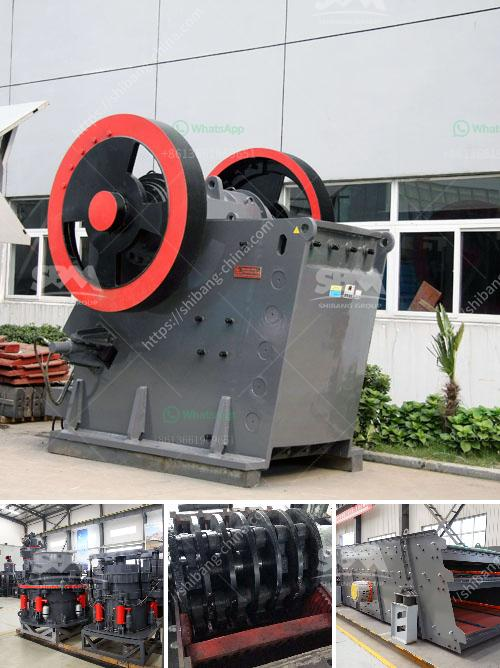

<h3>cement plant in assam</h3>
The cement industry is a vital part of Assam's economy, contributing significantly to the state's industrial growth and employment generation. Assam is known for its rich limestone deposits, which are essential for cement production. This has led to the establishment of several cement plants in the region, with each plant holding immense potential for the future development of the state.

One prominent cement plant in Assam is the Barak Valley Cement plant. Located in the southern part of the state, this plant has been instrumental in fulfilling the cement demands of the region. With its state-of-the-art technology and efficient production processes, the Barak Valley Cement plant has consistently delivered high-quality cement to various sectors including infrastructure, construction, and housing.

Another notable cement plant in Assam is the Bokajan Cement plant. Situated in the Karbi Anglong district, this plant has been a significant contributor to the cement industry in the state. It has not only strengthened the local economy but has also played a pivotal role in creating employment opportunities for the people of Assam.

The cement plants in Assam have not only catered to the local demands but have also supplied cement to neighboring states like Meghalaya, Mizoram, and Tripura. This has further enhanced the economic growth of the region and solidified Assam's position as a cement production hub in Northeast India.

In addition to the economic benefits, cement plants in Assam have also been keen on environmental sustainability. They have taken measures to reduce pollution and promote eco-friendly practices throughout the production process. Many cement plants in the state have adopted advanced technologies to minimize carbon emissions and efficiently manage waste products.

The government of Assam has recognized the significance of cement plants in boosting the state's economy and has supported their growth through various policies and incentives. By facilitating the establishment of cement plants, the government has sought to attract investments, create jobs, and strengthen the overall industrial infrastructure of Assam.

In conclusion, the cement plants in Assam have played a crucial role in the state's economic development. With their advanced technologies, quality production, and environmentally friendly practices, these plants have not only met the cement demands of the region but have also contributed to the growth of nearby states. As Assam continues to focus on industrial expansion, the cement industry is expected to play an even bigger role in shaping the state's future.
<h3>Contact us</h3><ul><li><strong>Whatsapp:&nbsp;<a href="https://wa.me/8613661969651">+8613661969651</a></strong></li><li><a href="https://swt.shibang-china.com/?git&amp;zhl&amp;cement plant in assam"><strong>Online Service(chat now)</strong></a></li></ul><h3>Related</h3><ul><li><a href='price hammer crusher nigeria.md'>price hammer crusher nigeria</a></li><li><a href='crusher for aggregate.md'>crusher for aggregate</a></li><li><a href='cement clinker ball mill.md'>cement clinker ball mill</a></li><li><a href='the highest capacity of granite crusher.md'>the highest capacity of granite crusher</a></li><li><a href='difference between ball mill and roller mill.md'>difference between ball mill and roller mill</a></li></ul>