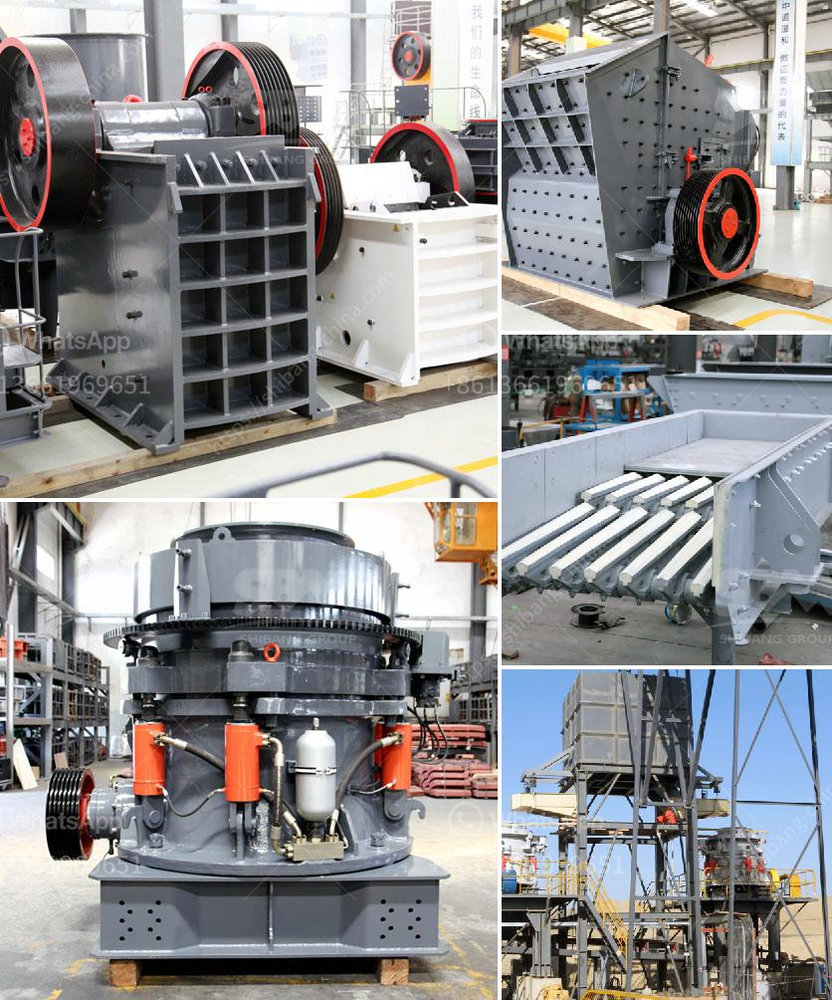

<h3>cement plant in brazil</h3>
Brazil is one of the fastest-growing economies in the world, with its construction sector playing a pivotal role in its development. Central to this industry is the cement production sector, which serves as the backbone for the nation's infrastructure projects. In this article, we will delve into the importance of cement plants in Brazil and touch on the challenges they face.

The Brazilian cement industry has been steadily growing over the years, driven by the construction boom in the country. Cement plants, both large and small, have played a crucial role in meeting the demand for this essential construction material. They are a vital link in the supply chain, ensuring a steady flow of cement to infrastructure projects, residential developments, and commercial buildings.

One of the major cement plant groups in Brazil is Votorantim Cimentos. With a history dating back to 1933, it has become a prominent player not only in Brazil but also in several other countries. Votorantim Cimentos operates numerous cement plants across Brazil, producing high-quality cement to meet the diverse needs of the market.

These cement plants are strategically located across the country, which allows for efficient transportation and delivery of cement to construction sites. This geographical advantage reduces logistical costs and ensures a reliable supply chain. Additionally, the proximity of cement plants to the demand centers minimizes environmental impact by reducing carbon emissions associated with transportation.

Furthermore, cement plants in Brazil have made significant strides in adopting eco-friendly practices. Many plants are investing in alternative fuels and energy sources to power their operations, thereby reducing reliance on fossil fuels and minimizing environmental damage. By embracing sustainable practices, these plants can contribute to a cleaner and greener future for Brazil's construction industry.

Despite the positive contributions made by cement plants in Brazil, they are not without challenges. One of the major hurdles faced by this industry is the volatility of raw material prices, particularly in relation to limestone and other key components used in cement production. Fluctuations in these prices can increase production costs, ultimately impacting the final price of cement and the overall profitability of cement plants.

Furthermore, the cement industry in Brazil, like many others around the world, faces the challenge of reducing carbon emissions. Cement production releases a significant amount of CO2, contributing to environmental degradation and climate change. Cement plants in Brazil must innovate and implement sustainable practices, such as carbon capture and storage technologies, to mitigate their environmental impact.

Despite these challenges, the cement plant industry in Brazil remains a crucial pillar of the construction sector. It provides employment opportunities, drives economic growth, and supports the development of infrastructure needed for a thriving nation. Cement plants are an integral part of Brazil's journey toward a sustainable and resilient construction industry.

In conclusion, cement plants in Brazil have emerged as key players in the construction sector, supporting the nation's growth and development. With efficient logistics, high-quality products, and a commitment to sustainability, these plants are the backbone of the cement industry in Brazil. By addressing challenges such as price volatility and environmental impact, they will continue to play a crucial role in Brazil's journey toward a prosperous and sustainable future.
<h3>Contact us</h3><ul><li><strong>Whatsapp:&nbsp;<a href="https://wa.me/8613661969651">+8613661969651</a></strong></li><li><a href="https://swt.shibang-china.com/?git&amp;zhl&amp;cement plant in brazil"><strong>Online Service(chat now)</strong></a></li></ul><h3>Related</h3><ul><li><a href='buy a roll crusher in india.md'>buy a roll crusher in india</a></li><li><a href='kaolin powder machine.md'>kaolin powder machine</a></li><li><a href='calcium carbonate manufacturing machine.md'>calcium carbonate manufacturing machine</a></li><li><a href='power calculation hammer mill equation.md'>power calculation hammer mill equation</a></li><li><a href='mill ore grind size passing 200 mesh.md'>mill ore grind size passing 200 mesh</a></li></ul>