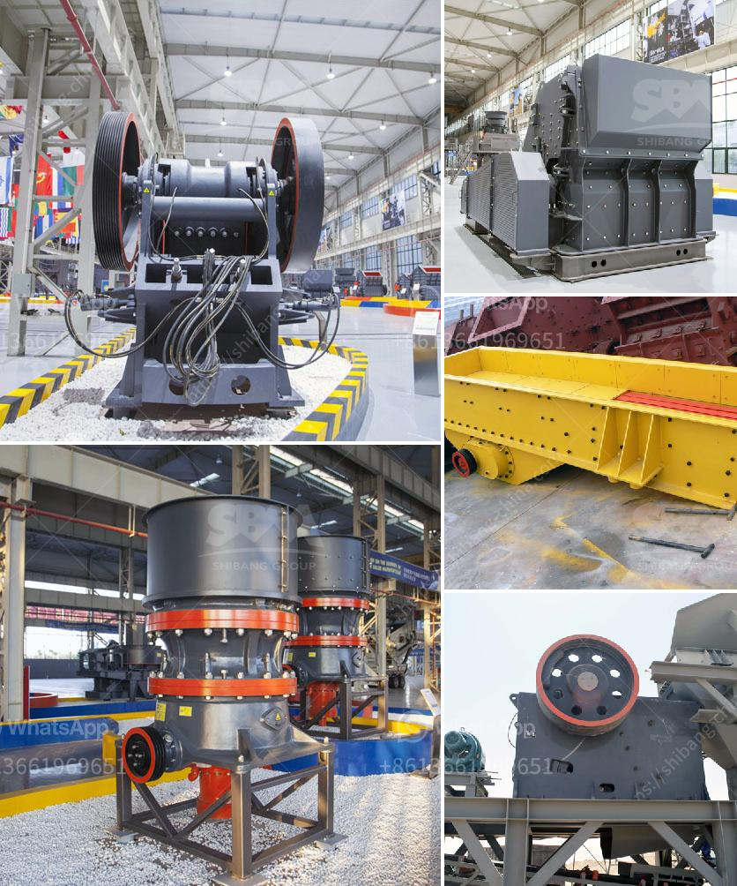

<h3>cement plant maintenance manual pdf</h3>
Cement is one of the most widely used materials in construction, and its production involves a combination of raw materials, including limestone, clay, and other substances. The process of manufacturing cement includes several steps, such as crushing, blending, heating, grinding, and final packaging. To ensure optimal performance and productivity of a cement plant, regular maintenance is essential. A comprehensive maintenance manual, provided in the form of a PDF file, can help cement plant operators optimize the overall maintenance process.

A cement plant maintenance manual PDF contains instructions, guidelines, and recommendations for the upkeep and maintenance of various components of a cement plant. This manual can be a helpful tool for plant maintenance and management teams as it provides clear understanding of the different aspects of the maintenance process.

The manual typically includes detailed information about the maintenance schedule, checklists, and procedures for inspecting, repairing, and replacing equipment components. It may cover topics such as lubrication practices, cleaning procedures, and safety guidelines. Key equipment components that require regular maintenance in a cement plant may include crushers, mills, kilns, coolers, conveyors, and other specialized machinery.

The maintenance manual PDF can also provide troubleshooting tips and troubleshooting guides, assisting operators in identifying and resolving common issues that may arise during operation. It may include a list of common problems, their causes, and potential solutions, allowing plant personnel to quickly address maintenance issues and minimize downtime.

Furthermore, the manual may offer guidance on record-keeping and documentation, emphasizing the importance of maintaining accurate records of maintenance activities. These records can be useful for tracking the history of equipment maintenance, identifying recurring issues, and planning future maintenance activities.

In addition to equipment maintenance, the manual may also provide recommendations for infrastructure and facility maintenance. This can include guidelines for maintaining the plant's buildings, ventilation systems, electrical systems, and other critical infrastructure. Regular inspections and maintenance of the plant's infrastructure can help prevent potential safety hazards and ensure smooth operation.

Overall, a cement plant maintenance manual PDF serves as a valuable resource for cement plant operators and maintenance personnel. By following the guidelines and recommendations outlined in the manual, cement plant operators can optimize their maintenance process, efficiently address issues, and maximize the lifespan and performance of their equipment and infrastructure.

In conclusion, a cement plant maintenance manual PDF is a crucial tool for cement plant operators. It provides comprehensive instructions, guidelines, and recommendations for the maintenance of various components in a cement plant. By following the recommendations outlined in the manual, operators can ensure optimal performance, minimize downtime, and prolong the lifespan of their equipment.
<h3>Contact us</h3><ul><li><strong>Whatsapp:&nbsp;<a href="https://wa.me/8613661969651">+8613661969651</a></strong></li><li><a href="https://swt.shibang-china.com/?git&amp;zhl&amp;cement plant maintenance manual pdf"><strong>Online Service(chat now)</strong></a></li></ul><h3>Related</h3><ul><li><a href='gold processing plant for sale.md'>gold processing plant for sale</a></li><li><a href='hard rock pulverizer crusher.md'>hard rock pulverizer crusher</a></li><li><a href='coal washing plant drawing.md'>coal washing plant drawing</a></li><li><a href='chrome lead ore vsi crusher manufacturer.md'>chrome lead ore vsi crusher manufacturer</a></li><li><a href='trackmounted equipment.md'>track-mounted equipment</a></li></ul>