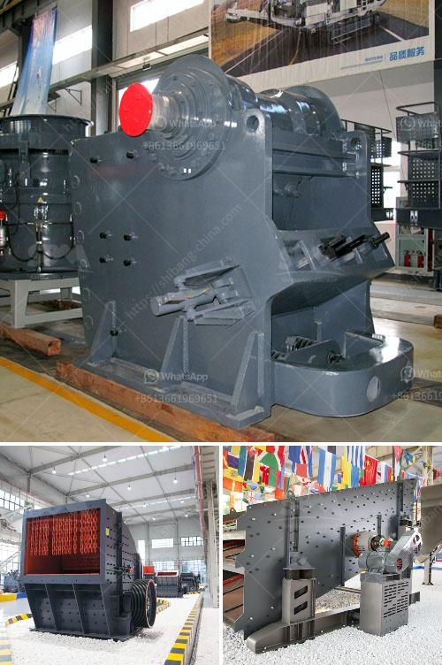

<h3>cement plant setup cost in philippines</h3>
The cement industry is booming in the Philippines, thanks to the rapid infrastructure development in the country. With a population of over 100 million people and a strong demand for cement, the Philippines is an ideal location for cement plant setups.

However, before a cement plant is built, it is important to assess the cost implications. The total project cost for setting up a cement plant depends on several factors, including the location, size, and scale of the plant.

One of the main considerations is the availability of land. Cement plants require a large area for production and storage. The cost of land can vary greatly depending on the location and proximity to urban areas. It is important to conduct a thorough survey and analysis of potential sites to determine the most suitable and cost-effective location.

Another major cost factor is the construction of the plant itself. This includes the cost of materials, labor, and machinery. Cement plants require heavy machinery and specialized equipment, such as crushers, kilns, and mixers, which can be costly to procure and transport. Additionally, skilled labor is essential for the construction and operation of a cement plant.

Furthermore, there are other costs to consider, such as obtaining necessary permits and licenses, conducting environmental impact assessments, and complying with safety regulations. These costs can vary depending on the region and local regulations.

In conclusion, setting up a cement plant in the Philippines requires a thorough understanding of the local market, as well as careful planning and budgeting. The cost of establishing a cement plant depends on several factors, including the location, size, and scale of the plant. Proper research and analysis, coupled with strategic decision-making, can help mitigate the setup costs and ensure a successful cement plant investment in the Philippines.
<h3>Contact us</h3><ul><li><strong>Whatsapp:&nbsp;<a href="https://wa.me/8613661969651">+8613661969651</a></strong></li><li><a href="https://swt.shibang-china.com/?git&amp;zhl&amp;cement plant setup cost in philippines"><strong>Online Service(chat now)</strong></a></li></ul><h3>Related</h3><ul><li><a href='nigeria mobile crusher.md'>nigeria mobile crusher</a></li><li><a href='cone crusher germany.md'>cone crusher germany</a></li><li><a href='stone jaw crusher for rock crushing.md'>stone jaw crusher for rock crushing</a></li><li><a href='portable sand and gravel wash plants for sale.md'>portable sand and gravel wash plants for sale</a></li><li><a href='raymond mill supplier.md'>raymond mill supplier</a></li></ul>