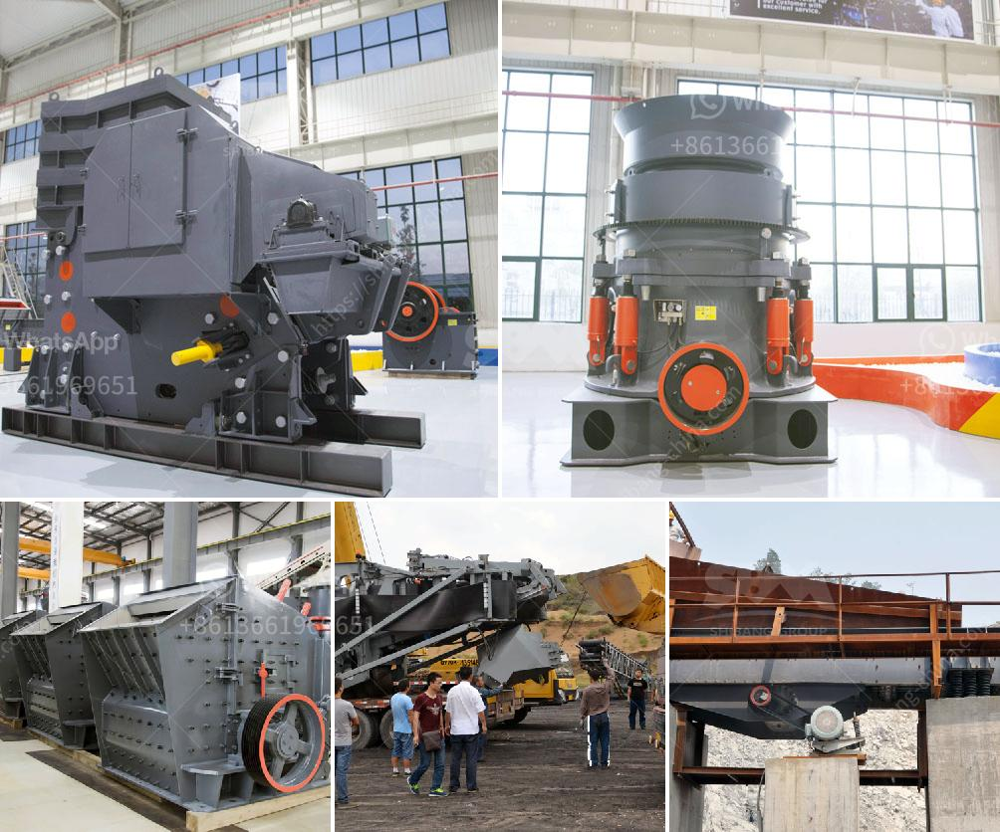

<h3>cheap gravel crusher</h3>
Are you tired of spending a fortune on gravel for your construction projects? Do you wish there was a more cost-effective solution? Well, look no further! In this article, we will introduce you to the world of cheap gravel crushers, offering you an affordable alternative to traditional methods of obtaining gravel.

Gravel is an essential material used in various construction projects, such as road work, landscaping, and building foundations. However, the cost of purchasing gravel can quickly add up, especially if you have massive projects requiring a significant amount of it. That's where cheap gravel crushers come into play.

Cheap gravel crushers are machines designed to break down gravel into smaller pieces. These machines are typically used in construction sites to help reduce the size of the gravel, making it more manageable and cost-effective to transport. They work by applying force to the gravel, breaking it down into smaller particles that can be easily spread and used for construction purposes.

One of the main advantages of cheap gravel crushers is their affordability. Unlike purchasing gravel from a supplier, investing in a gravel crusher allows you to have an unlimited supply of gravel at your disposal. This means you no longer have to worry about fluctuating prices or running out of gravel during a crucial stage of your project. Instead, you can control and manage your own supply, saving significant amounts of money in the long run.

Another benefit of cheap gravel crushers is their portability. Many models are lightweight and compact, making them easy to transport and maneuver on different construction sites. This flexibility allows you to bring the crusher directly to the location where the gravel is needed, reducing transportation costs and eliminating the need for expensive trucking services.

Additionally, cheap gravel crushers are straightforward to operate. Most models are user-friendly, meaning you don't need extensive training or specialized skills to use them. This simplicity enables you or your construction crew to quickly and efficiently produce the gravel needed for your project, saving time and labor costs.

When choosing a cheap gravel crusher, there are a few factors to consider. First and foremost, ensure the machine meets your project's requirements in terms of capacity and output. It's also essential to assess the durability and reliability of the equipment to ensure it will withstand the demands of your construction site.

In conclusion, cheap gravel crushers offer a cost-effective and practical alternative to traditional gravel purchasing methods. By investing in a gravel crusher, you can save money, have a constant supply of gravel, and easily transport the material to your construction site. Moreover, these machines are simple to operate and are flexible in terms of portability. Ultimately, they are a game-changer for construction professionals looking to reduce costs and improve efficiency. Why spend more on gravel when you can crush it yourself?
<h3>Contact us</h3><ul><li><strong>Whatsapp:&nbsp;<a href="https://wa.me/8613661969651">+8613661969651</a></strong></li><li><a href="https://swt.shibang-china.com/?git&amp;zhl&amp;cheap gravel crusher"><strong>Online Service(chat now)</strong></a></li></ul><h3>Related</h3><ul><li><a href='harga mesin crusher batu kapasitas 300 ton per jam.md'>harga mesin crusher batu kapasitas 300 ton per jam</a></li><li><a href='quicklime production process.md'>quicklime production process</a></li><li><a href='allis chalmers 54 x 74 gyratory crusher.md'>allis chalmers 54 x 74 gyratory crusher</a></li><li><a href='cement plant in brazil.md'>cement plant in brazil</a></li><li><a href='granite crusher machine.md'>granite crusher machine</a></li></ul>