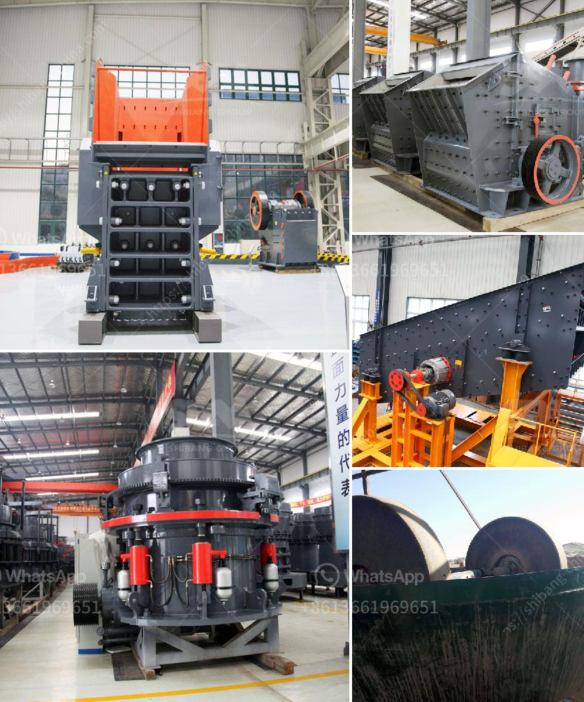

<h3>china ball mill manufacturer</h3>
China is a leading manufacturer and exporter of industrial ball mill units worldwide. This machine is renowned for its versatility and reliability in grinding materials into fine powders. With its extensive range of applications, it plays a crucial role in various industries, including mining, cement, ceramics, and chemicals.

China has a well-established network of ball mill manufacturers and suppliers that offer high-quality, innovative machines to meet the evolving needs of their customers. These mills are renowned for their low maintenance costs, excellent energy efficiency, and longevity in operation. They are engineered to handle a wide variety of materials, from soft, delicate ones to abrasive and hard substances.

China's ball mill manufacturing industry thrives due to its commitment to research and development. Manufacturers constantly innovate to improve the functionality and performance of their machines. As a result, the market is flooded with modern ball mill designs that enhance productivity and efficiency while reducing energy consumption and environmental impact.

China's ball mill manufacturers are also known for their excellent customer service and after-sales support. They work closely with clients to understand their specific requirements and provide customized solutions. Timely technical assistance, spare parts availability, and regular maintenance checks are some of the comprehensive services offered.

Furthermore, China's ball mill manufacturers prioritize sustainability and environmental responsibility. These companies make significant efforts to reduce emissions, waste, and energy consumption in their manufacturing processes. Many manufacturers have adopted clean technologies and implemented strict quality control measures to minimize their environmental impact.

In conclusion, China's ball mill manufacturers stand out for their exceptional manufacturing capabilities, cutting-edge technology, and commitment to customer satisfaction. With their extensive range of models and applications, these mills are indispensable in numerous industries worldwide. As China continues to invest in research and development, we can expect continuous improvements in the quality and efficiency of ball mill manufacturing in the years to come.
<h3>Contact us</h3><ul><li><strong>Whatsapp:&nbsp;<a href="https://wa.me/8613661969651">+8613661969651</a></strong></li><li><a href="https://swt.shibang-china.com/?git&amp;zhl&amp;china ball mill manufacturer"><strong>Online Service(chat now)</strong></a></li></ul><h3>Related</h3><ul><li><a href='used stone crushers for sale in accra.md'>used stone crushers for sale in accra</a></li><li><a href='materials for conveyor belts in nigeria.md'>materials for conveyor belts in nigeria</a></li><li><a href='stone crushing business in zimbabwe.md'>stone crushing business in zimbabwe</a></li><li><a href='used stone crusher mini plant india.md'>used stone crusher mini plant india</a></li><li><a href='stone quarry crusher companies in ghana.md'>stone quarry crusher companies in ghana</a></li></ul>