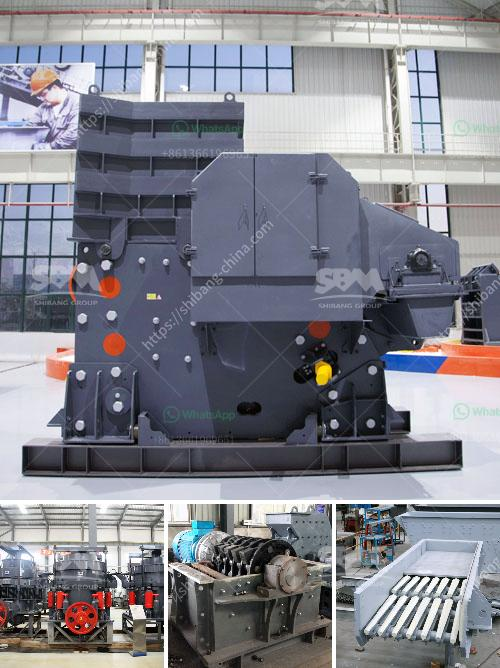

<h3>china ball valve grinding machine</h3>
In the manufacturing industry, precision and efficiency are of utmost importance. One of the critical components used in various industries, such as oil and gas, chemical, and water treatment, is the ball valve. Ball valves are used to control the flow of fluids and gases, making them a vital part of many processes. Ensuring the quality and precision of ball valves is crucial for the smooth operation of these industries. That is where China's ball valve grinding machines come into play.

China has emerged as a global manufacturing powerhouse, offering a wide range of high-quality products at competitive prices. The ball valve grinding machine is one such product that exemplifies China's manufacturing excellence. This innovative machine has revolutionized the process of manufacturing ball valves, significantly improving efficiency and precision.

The ball valve grinding machine utilizes a grinding wheel or abrasive tool to cut and shape the valve's spherical surface. This machine eliminates the manual labor-intensive process of manually grinding the valve, which was both time-consuming and prone to human error. With the help of this automated machinery, the manufacturing industry can now produce ball valves with exceptional accuracy, ensuring a tight and reliable seal.

China's ball valve grinding machines are designed to handle a wide range of valve sizes and types, making them versatile and cost-effective for manufacturers. Whether it is a small-sized valve or a large industrial-grade ball valve, these machines can handle the grinding process with great efficiency. They are equipped with advanced technology, such as precision measuring systems and computer numerical control (CNC), which allows for the production of highly accurate and consistent ball valve surfaces.

The use of ball valve grinding machines brings several advantages to the manufacturing industry. First and foremost, it enhances productivity. These machines can grind and shape a valve's spherical surface in a fraction of the time it takes for manual grinding, thereby boosting overall production rates. As a result, manufacturers can meet increasing demand and deadlines without compromising on the quality of their products.

Moreover, the precision achieved by the ball valve grinding machine ensures a perfect fit and tight seal, reducing the risk of leakage and potential operational issues. By maintaining tight control over the tolerances and surface finish of ball valves, these machines contribute to the overall reliability and safety of systems that rely on these components.

Furthermore, the use of automated grinding machines reduces the reliance on skilled labor. With labor costs being a significant factor in manufacturing, these machines help manufacturers streamline their operations and reduce workforce expenses. This cost-effective solution makes it more feasible for even small-scale manufacturers to produce high-quality ball valves.

China's ball valve grinding machines have gained recognition and appreciation from the global manufacturing industry. Suppliers and manufacturers worldwide acknowledge the reliability, precision, and affordability of these advanced machines. By investing in this technology, companies can enhance their competitive edge, improve operational efficiency, and deliver superior products to their customers.

In conclusion, China's ball valve grinding machines are a game-changer in the manufacturing industry. With their advanced technology, efficiency, and precision, these machines have transformed the way ball valves are produced. The benefits they offer, including increased productivity, enhanced quality, and cost-effectiveness, make them a valuable asset for manufacturers worldwide. As the demand for high-quality ball valves continues to grow, investing in these automated grinding machines becomes an indispensable choice for companies that aim to thrive in the competitive global market.
<h3>Contact us</h3><ul><li><strong>Whatsapp:&nbsp;<a href="https://wa.me/8613661969651">+8613661969651</a></strong></li><li><a href="https://swt.shibang-china.com/?git&amp;zhl&amp;china ball valve grinding machine"><strong>Online Service(chat now)</strong></a></li></ul><h3>Related</h3><ul><li><a href='vertical mill size distribution.md'>vertical mill size distribution</a></li><li><a href='aggregate quarries crusher in thailand.md'>aggregate quarries crusher in thailand</a></li><li><a href='technical specs 400mm x 600mm jaw crusher.md'>technical specs 400mm x 600mm jaw crusher</a></li><li><a href='crusher processing plant malaysia.md'>crusher processing plant malaysia</a></li><li><a href='crusher machine sale.md'>crusher machine sale</a></li></ul>