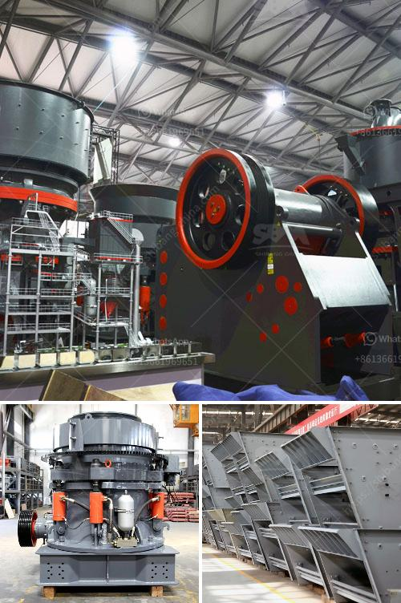

<h3>china coal mill grinder manufacturers china</h3>
China, with its vast coal reserves, is the world's largest producer and consumer of coal. The country has been heavily reliant on this fossil fuel for meeting its energy needs and powering its rapid industrial growth. To facilitate the utilization of coal, China has seen the emergence of numerous coal mill grinder manufacturers, who cater to the increasing demand for coal grinding equipment. These manufacturers have not only propelled China's coal industry forward but have also made significant contributions to the global energy landscape.

One of the leading coal mill grinder manufacturers in China is Shanghai Shibang Machinery Co., Ltd. With its strong R&D capabilities and manufacturing expertise, the company has successfully established its presence in domestic and international markets. Their coal mill grinders are widely used in thermal power plants, cement plants, and other industries where coal grinding is essential. The company's grinders are known for their high grinding efficiency, low power consumption, and long service life, making them highly sought after by customers.

Another prominent player in the coal mill grinder market is Henan Hongxing Mining Machinery Co., Ltd. The company has been manufacturing and supplying coal mill grinders for several decades. Their grinders are renowned for their reliability and robustness, enabling them to withstand the harsh operating conditions in coal grinding applications. Hongxing's products are in high demand not only in China but also in international markets, including Southeast Asia, the Middle East, and Africa.

China's coal mill grinder manufacturers have been quick to adopt innovative technologies to enhance their products' performance. For instance, many manufacturers have introduced advanced grinding systems with improved control and automation features. These systems enable operators to optimize the grinding process, resulting in better product quality and reduced energy consumption. Furthermore, manufacturers are also focusing on developing grinders with higher capacities to meet the growing demand for coal grinding.

In addition to technological advancements, environmental considerations have also driven the innovation in coal mill grinders. With increasing concerns over air pollution and carbon emissions, manufacturers are incorporating advanced dust collection and control systems into their equipment. These systems not only ensure a cleaner working environment but also minimize the release of harmful particulate matter into the atmosphere.

Furthermore, China's coal mill grinder manufacturers are actively pursuing sustainable practices throughout their operations. This includes the adoption of energy-efficient manufacturing processes, recycling and reusing materials, and reducing waste generation. By embracing these practices, manufacturers are not only improving their environmental performance but also setting an example for other industries to follow.

China's coal mill grinder manufacturers have played a crucial role in supporting the country's ambitious energy goals. Their high-quality and efficient grinders have helped optimize coal utilization, leading to improved energy efficiency and reduced environmental impacts. As China continues to transition towards cleaner energy sources, these manufacturers will play an even more significant role in facilitating this transition.

In conclusion, China's coal mill grinder manufacturers have emerged as leaders in the industry, catering to the growing demand for coal grinding equipment. Through technological advancements, environmental considerations, and a commitment to sustainability, these manufacturers have not only met the needs of the domestic market but have also established a strong presence in international markets. Their products have become indispensable in various industries, contributing to China's economic growth and the global energy landscape.
<h3>Contact us</h3><ul><li><strong>Whatsapp:&nbsp;<a href="https://wa.me/8613661969651">+8613661969651</a></strong></li><li><a href="https://swt.shibang-china.com/?git&amp;zhl&amp;china coal mill grinder manufacturers china"><strong>Online Service(chat now)</strong></a></li></ul><h3>Related</h3><ul><li><a href='marble crusher machines usa.md'>marble crusher machines usa</a></li><li><a href='conveyor belts kenya.md'>conveyor belts kenya</a></li><li><a href='price of crushing machine.md'>price of crushing machine</a></li><li><a href='dry grinding rod mill.md'>dry grinding rod mill</a></li><li><a href='to buy medium mounted stone crusher in uk.md'>to buy medium mounted stone crusher in uk</a></li></ul>