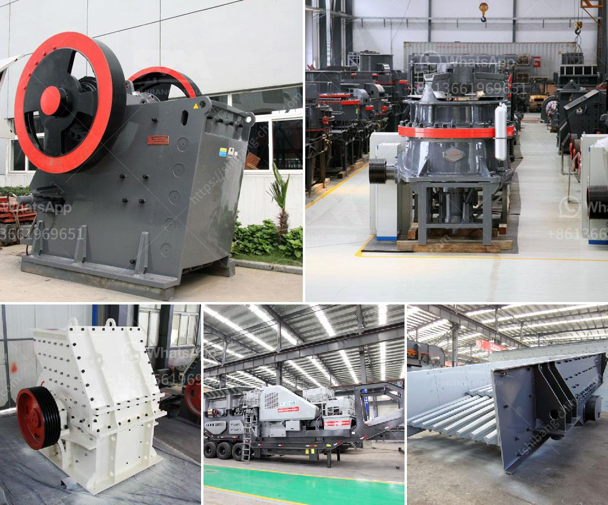

<h3>china coal washing plant</h3>
China is the world's largest producer and consumer of coal, accounting for nearly half of the global coal consumption. As a result, coal washing plants are becoming increasingly important in the country to help meet the growing demand for coal.

In China, coal is known as the "black gold" due to its importance as a primary energy source. The key objective of coal washing is to remove impurities from coal to make it clean, environmentally friendly, and suitable for various applications. This process involves using water, chemicals, and mechanical techniques to separate coal from its impurities.

One prominent coal washing plant in China is the Datong Coal Washing Plant, located in the Shanxi Province, which has been operating for more than 30 years. It is one of the largest coal washing plants in the region and has the capacity to process 1.8 million tons of raw coal each year.

The plant utilizes a combination of dense medium cyclone, jig, and flotation processes to clean the coal. Dense medium cyclones are used to provide a fast yet effective separation of coal and rock particles based on their density differences. Jigs are then employed to further separate the clean coal from the washery rejects (rock and coal particles that are too fine or large for usage). Finally, flotation is used to remove impurities, such as sulfur and ash, from the clean coal.

The Datong Coal Washing Plant has demonstrated its commitment to environmental sustainability by implementing various measures to minimize its environmental impact. For instance, it adopts advanced dust suppression technology to control dust emissions and utilizes water recycling systems to reduce water consumption.

Furthermore, the plant also aims to maximize resource utilization. It has implemented a comprehensive waste management system to handle the washery rejects and coal fines effectively. These by-products are carefully treated and tested to ensure compliance with environmental regulations.

The advantages of coal washing in China are numerous. Firstly, it enhances the calorific value of coal, making it burn more efficiently and reducing greenhouse gas emissions. Additionally, coal washing reduces the release of pollutants during combustion, such as sulfur dioxide and nitrogen oxide, thereby improving air quality.

Moreover, coal washing improves the safety of coal mining operations by reducing the risk of explosions caused by the presence of flammable gases in coal seams. By removing these gases through washing, the potential for accidents and fatalities is significantly reduced.

Despite the numerous benefits associated with coal washing, challenges remain. The cost of installing and operating coal washing plants can be substantial, particularly for smaller operators. Additionally, water scarcity in certain regions of China can present a hurdle for water-intensive coal washing processes.

In conclusion, coal washing plants play a crucial role in China's coal industry by improving the quality, efficiency, and environmental performance of coal. The Datong Coal Washing Plant is an excellent example of how these plants are addressing the country's growing demand for cleaner coal. As China continues to rely on coal as a primary energy source, investing in coal washing technology is vital to ensure sustainable development and a greener future.
<h3>Contact us</h3><ul><li><strong>Whatsapp:&nbsp;<a href="https://wa.me/8613661969651">+8613661969651</a></strong></li><li><a href="https://swt.shibang-china.com/?git&amp;zhl&amp;china coal washing plant"><strong>Online Service(chat now)</strong></a></li></ul><h3>Related</h3><ul><li><a href='distributor of crushing machines in malaysia.md'>distributor of crushing machines in malaysia</a></li><li><a href='vertical mill size distribution.md'>vertical mill size distribution</a></li><li><a href='price for ball mills.md'>price for ball mills</a></li><li><a href='second hand mobile crushers and screens south africa.md'>second hand mobile crushers and screens south africa</a></li><li><a href='price 100 tph crusher plant.md'>price 100 tph crusher plant</a></li></ul>