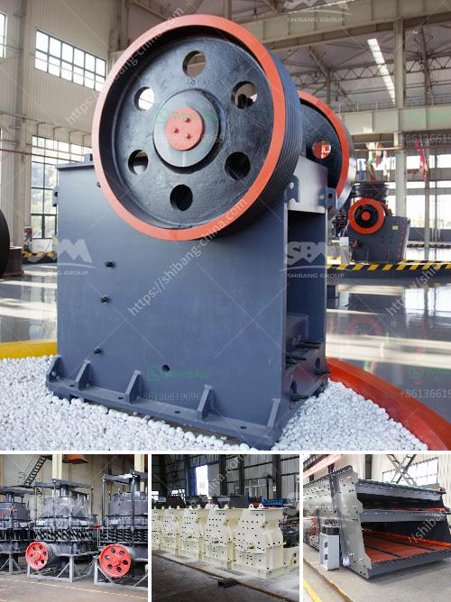

<h3>china conveyor belts</h3>
Conveyor belts are an essential component of numerous industries, enabling the smooth transportation of goods from one point to another. Among the leading global manufacturers, China has emerged as a key player in the conveyor belt industry, known for its high-quality products and competitive prices.

Chinese conveyor belt manufacturers have significantly contributed to the growth of various sectors both domestically and globally. The automotive industry relies on conveyor belts for efficient movement of vehicles during production processes. Similarly, the mining industry heavily relies on conveyor belts to transport raw materials from extraction sites. From food processing to logistics and packaging, conveyor belts have become a vital tool for streamlining and automating operations.

Chinese manufacturers have gained a reputation for producing conveyor belts that meet international quality standards, ensuring durability, reliability, and high performance. This has enabled Chinese companies to capture a significant share in the global market. Furthermore, China's investment in research and development allows manufacturers to stay ahead of the curve by introducing innovative conveyor belt technologies.

In addition to offering a wide range of conveyor belt options, Chinese manufacturers provide customization and after-sales services, which further enhance customer satisfaction. Moreover, their pricing strategies make Chinese conveyor belts a cost-effective choice for businesses, especially for those operating on a large scale.

However, it is crucial to ensure ethical production practices when sourcing conveyor belts from China. Due to its vast manufacturing capacity, the country has faced criticism regarding labor rights and environmental regulations. Buyers should partner with manufacturers who prioritize social responsibility and adhere to internationally recognized standards.

As China continues to modernize its industries and gain expertise in cutting-edge technologies, the conveyor belt sector is expected to witness further growth in the coming years. Chinese manufacturers will likely remain at the forefront of innovation, meeting the evolving demands of various industries and contributing to global economic development.

In conclusion, China's conveyor belt industry is a powerhouse, providing essential equipment to industries worldwide. With its focus on quality, innovation, and competitive pricing, Chinese manufacturers have earned a significant market share. As long as ethical production practices are observed, China's conveyor belts will undoubtedly continue to play a vital role in enabling smooth operations across a range of sectors globally.
<h3>Contact us</h3><ul><li><strong>Whatsapp:&nbsp;<a href="https://wa.me/8613661969651">+8613661969651</a></strong></li><li><a href="https://swt.shibang-china.com/?git&amp;zhl&amp;china conveyor belts"><strong>Online Service(chat now)</strong></a></li></ul><h3>Related</h3><ul><li><a href='small mobile rock pulverizer.md'>small mobile rock pulverizer</a></li><li><a href='crusher seller in ethiopia.md'>crusher seller in ethiopia</a></li><li><a href='gold wash plants built in the northwest.md'>gold wash plants built in the northwest</a></li><li><a href='stone crush rate in islamabad.md'>stone crush rate in islamabad</a></li><li><a href='process of river rock crushing to make cement.md'>process of river rock crushing to make cement</a></li></ul>