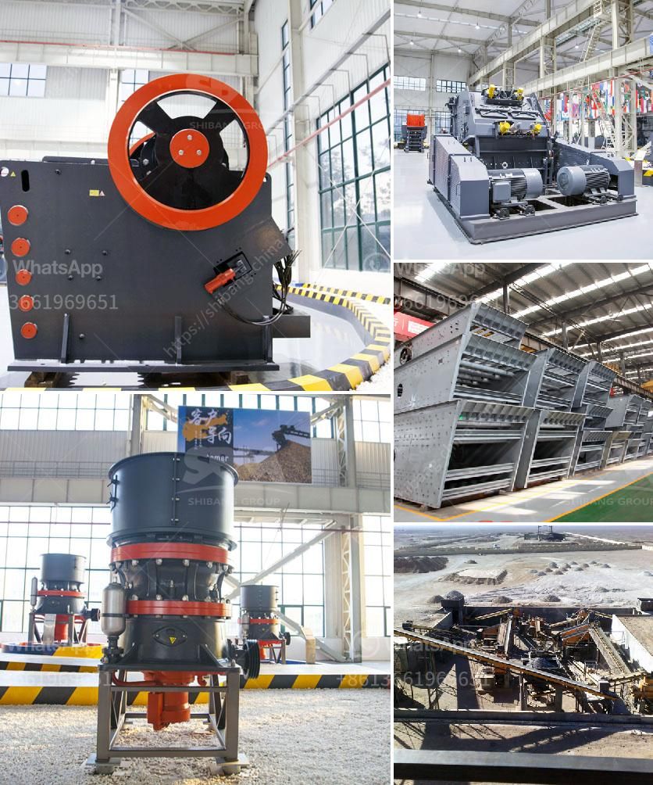

<h3>china granite crusher</h3>
China granite crusher is an ideal choice to crush abrasive raw material, it is also widely used to crush marble, hard limestone, feldspar, iron ore, copper ore, and gold ore. At the same time, a variety of hard stones can be processed for sanitary ware, porcelain bath stone, floor tiles, ceramics, ceramics, etc. China granite crusher not only improves the production capacity and crushing efficiency but also expands the scope of application.

Granite is a kind of igneous rock formed by the condensation of magma deep underground. It belongs to a kind of deep intrusive rock. It is not easy to be weathered like limestone or basalt, but also has high mining value. Granite has uniform structure, high compressive strength, low water absorption, and good wear resistance. Therefore, it is an excellent building material. It is often used in high-grade construction projects, such as highways, railways, airports, bridges, ports, tunnels, etc.

The China granite crusher can be used to produce granite aggregate and artificial sand. Granite raw material is crushed by jaw crusher, impact crusher or cone crusher, which can meet the different needs of customers. The sand making machine is suitable for the crushing and shaping of soft or medium hard and extremely hard materials. It is widely used in all kinds of rock, abrasive, refractory, cement clinker, quartz stone, iron ore, concrete aggregate, etc.

The structure of China granite crusher is simple, compact and portable. It can achieve the effect of crushing and screening, which can be used for the multi-stage crushing of high-quality granite without much wastage. The utility model has the advantages of small power consumption, convenient installation, simple operation, and convenient cleaning when replacing the hammer.

With the continuous development of the mining industry, China granite crusher has been favored by the vast number of users. Compared with traditional crushing equipment, it has many advantages, such as large crushing ratio, high production efficiency, low energy consumption, uniform particle size, etc. It is widely used in the crushing process of granite, basalt, limestone, river pebble, cement clinker, quartz stone, iron ore, bauxite and other minerals.

In recent years, China granite crusher has been continuously optimized and upgraded, adopting domestic advanced crushing technology, which has significantly improved the overall performance of the equipment. It has become a new generation of environmentally friendly and energy-saving crushing equipment. Its application in mining industry has gradually extended to various fields, such as metallurgy, chemical industry, building materials, water conservancy, railway and other industries.

In a word, China granite crusher plays an indispensable role in the mining industry, especially in the granite crushing production line. It has the advantages of high efficiency, low power consumption, and easy operation. It is an ideal choice for crushing granite. With the continuous improvement of China granite crusher, more and more users have recognized its unique advantages. It is bound to become the preferred equipment for granite processing.
<h3>Contact us</h3><ul><li><strong>Whatsapp:&nbsp;<a href="https://wa.me/8613661969651">+8613661969651</a></strong></li><li><a href="https://swt.shibang-china.com/?git&amp;zhl&amp;china granite crusher"><strong>Online Service(chat now)</strong></a></li></ul><h3>Related</h3><ul><li><a href='cement plant in brazil.md'>cement plant in brazil</a></li><li><a href='design calculation of jaw crusher pdf.md'>design calculation of jaw crusher pdf</a></li><li><a href='difference between ball mill and roller mill.md'>difference between ball mill and roller mill</a></li><li><a href='rock crusher plant operations manager.md'>rock crusher plant operations manager</a></li><li><a href='manufacturer of mineral beneficiation plant from china.md'>manufacturer of mineral beneficiation plant from china</a></li></ul>