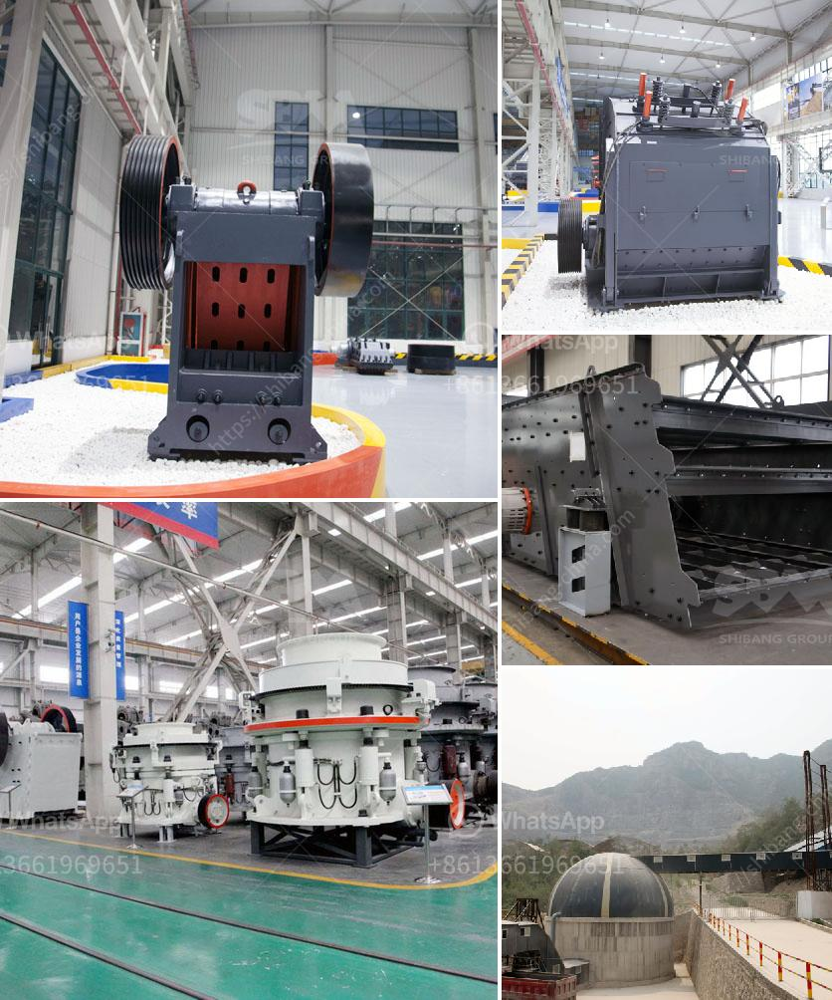

<h3>china henan machinery small ball mill</h3>
The small ball mill, also known as the mini ball mill, is a fundamental piece of equipment in the mining industry. It is used in the production of materials like cement, silicates, refractory materials, fertilizers, glass ceramics, etc. It plays a vital role in grinding crushed materials and making them into powder form.

When it comes to small ball mills, one of the renowned names in the industry is China Henan Machinery. This company has proven its mettle in manufacturing and supplying high-quality ball mills that ensure efficient and reliable grinding processes.

One of the key features of the small ball mill manufactured by China Henan Machinery is its compact size. This makes it easy to transport and install, even in small spaces. Industries and mines that have limited floor space can rely on this equipment without worrying about its footprint. It is designed to be easily maneuvered and stashed away when not in use.

The China Henan Machinery small ball mill boasts a remarkable energy-saving capability. This equipment utilizes a low-speed transmission system, ensuring that it operates smoothly and with reduced noise. It also minimizes the formation of dust during the grinding process. Additionally, its advanced technology reduces power consumption, making it an environmentally friendly choice.

Durability is another crucial aspect of the small ball mill produced by China Henan Machinery. It is made from high-quality materials, ensuring its strength and longevity. The shell of the mill is made of heavy-duty steel, which provides protection against abrasive materials and corrosive environments. Furthermore, its inner lining is made of wear-resistant materials, capable of withstanding the constant grinding and impact forces.

China Henan Machinery prioritizes safety in its small ball mill design. The machine is equipped with an advanced control system that ensures it operates within the specified parameters. Additionally, it includes safety features such as an emergency stop button and protective covers, preventing accidents and injuries during operation.

In terms of efficiency, the small ball mill by China Henan Machinery excels. Its innovative design maximizes the grinding process, resulting in an increased throughput of the material. Moreover, its precise control over the rotational speed and the size of the grinding media enables the production of fine and uniform powder.

The small ball mill produced by China Henan Machinery is suitable for various industries and applications. Its versatility allows it to grind different types of materials, from soft to hard. Whether it's cement, minerals, ores, or ceramic materials, this equipment can handle them all.

In conclusion, the China Henan Machinery small ball mill is a reliable and efficient grinding solution for various industries. Its compact size, energy-saving capabilities, durability, safety features, and high grinding efficiency make it a preferred choice for many mining and manufacturing companies. With its exceptional performance, it continues to be a valuable asset in the material processing industry.
<h3>Contact us</h3><ul><li><strong>Whatsapp:&nbsp;<a href="https://wa.me/8613661969651">+8613661969651</a></strong></li><li><a href="https://swt.shibang-china.com/?git&amp;zhl&amp;china henan machinery small ball mill"><strong>Online Service(chat now)</strong></a></li></ul><h3>Related</h3><ul><li><a href='jaw crusher vs cone crusher.md'>jaw crusher vs cone crusher</a></li><li><a href='vertical raw mill industry.md'>vertical raw mill industry</a></li><li><a href='gypsum production line price.md'>gypsum production line price</a></li><li><a href='tanzania stone crusher machine.md'>tanzania stone crusher machine</a></li><li><a href='silica sand grinding machine.md'>silica sand grinding machine</a></li></ul>